# Hands-on Lab: Build Your First GitHub Copilot Custom Agent

## Overview

In this lab you will create a **GitHub Copilot Custom Agent** called the **Poet Agent**. When a user invokes this agent, it writes a funny limerick about whatever subject they provide.

You will use GitHub Copilot itself to help you scaffold the agent - so you'll experience both _building_ a custom agent and _using_ Copilot as your coding partner.

### What you will learn

- How to set up a repository that supports custom GitHub Copilot agents.
- How to write a **requirements document** that describes what an agent should do.
- How to create an **`.agent.md`** file that defines the agent's personality, rules, and workflow.
- How to test the finished agent inside VS Code.

---

## Step 1 - Clone the Starter Repository

The starter repo already contains a `.github/instructions/custom-agent.instructions.md` file. This instruction file teaches Copilot _how_ to scaffold high-quality agent definitions for you - so you don't have to memorize the format / good conventions yourself.

1. Open a **terminal** (Command Prompt, PowerShell, or your preferred shell).
2. Navigate to the folder where you keep your projects - for example:

```powershell
cd c:\dev
```

3. Clone the lab repository:

```powershell
git clone https://github.com/markharrison/lab-customagents-init.git
cd lab-customagents-init
```

4. You wont be writing content back to the repo where this was downloaded from - so remove the .Git folder - in PowerShell:

```powershell
Remove-Item -Recurse -Force .git
```

5. Confirm the clone succeeded. You should see the file `custom-agent.instructions.md` in the listing.

```powershell
dir .github\instructions
```

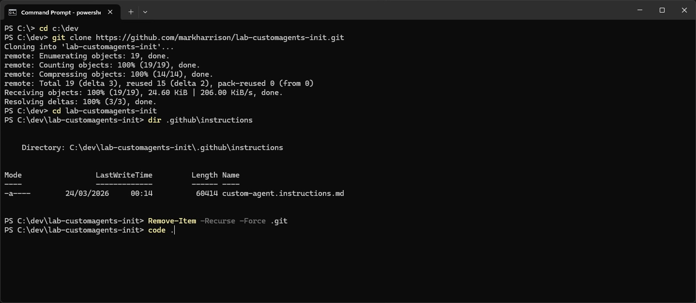

> [!NOTE]
> The `lab-customagents-init` repo folder can be renamed to an alternative name, if you intend to use this as the basis for creating your own custom agents.

## Step 2 - Open the Repository in VS Code

1. While still in your terminal inside the repo folder, run:

```powershell
code .
```

This opens the current folder as a VS Code workspace.

2. In the **Explorer** panel (left sidebar), confirm the folder structure includes:

```diagram
   ./
   ├── .github/
   │   ├── agents/          ← (empty - you will add your agent here)
   │   └── instructions/
   │       └── custom-agent.instructions.md
   ├── README.md
   └── ...
```

3. Open the **Copilot Chat** panel:
   - Confirm that Copilot Chat is active and responds to messages.

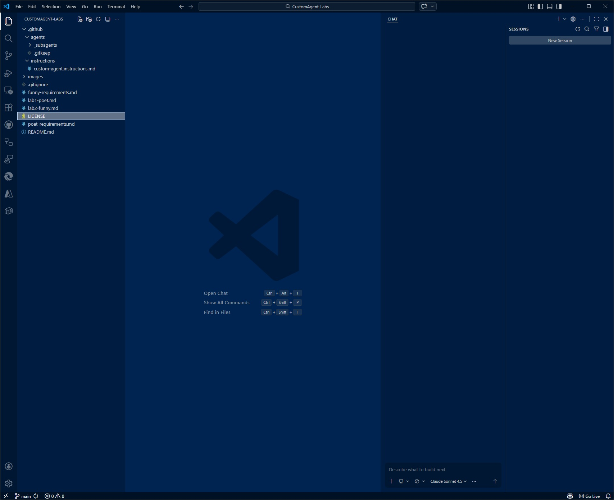

## Step 3 - Read the Instruction File (Optional but Recommended)

Before asking Copilot to generate anything, take a minute to skim the instruction file so you understand the conventions.

1. In VS Code, open `.github/instructions/custom-agent.instructions.md`.
2. Scan through the document. Key things to notice:
   - **Agent Archetypes** - Agent, Orchestrator, Subagent. For this lab you will build a simple **Agent**.
   - **Frontmatter** - Every `.agent.md` file starts with YAML frontmatter (`name`, `description`, `model`, `tools`).
   - **Body Sections** - Role line, Context, DO / DON'T, Workflow, Output Files, Validation Checklist.
   - **State Files** - Agents write progress to `./output/state/`.

> [!NOTE]
> You do _not_ need to memorise any of this. Copilot has already loaded the instruction file because it matches the `applyTo: "**/*.agent.md"` pattern. When you create a file ending in `.agent.md`, Copilot will automatically follow these rules.

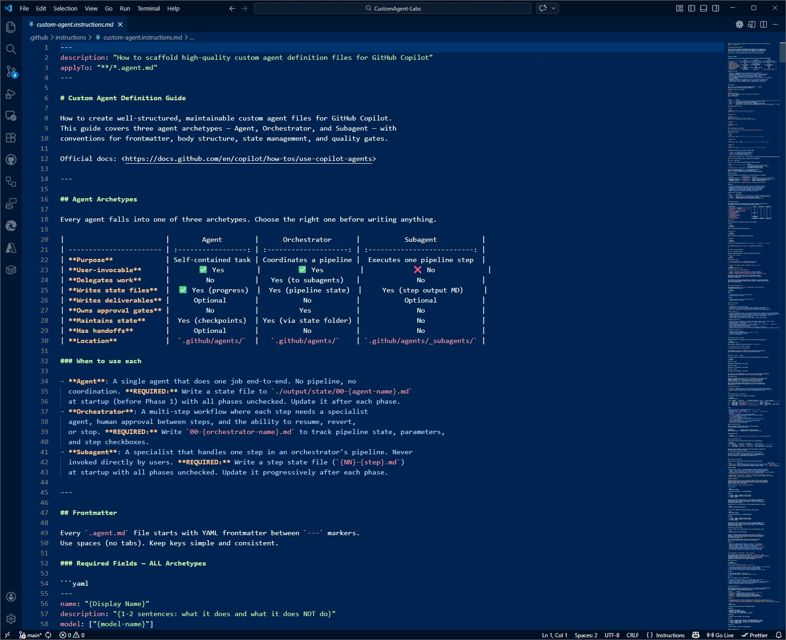

## Step 4 - Use Copilot to Write the Requirements Document

A good practice before building any agent is to describe _what_ it should do in a short requirements document. You will use Copilot Chat to help you draft this.

### 4.1 - Ask Copilot to draft the requirements

1. Open the **Copilot Chat** panel
2. Make sure you're in **Plan** mode - click the agent selector at the bottom of the chat panel and choose **Plan** if it is not already selected. We use Plan mode here because we are _planning_ what the agent should do, not asking Copilot to run tools or edit files.

You can also chose the model to use. The screenshot shows Clause Opus 4.6 but experiment with alternatives.

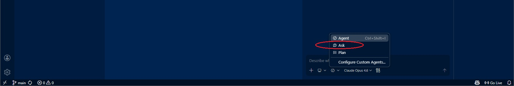

3. Type the following prompt into the chat:

   ```
   I want to build a GitHub Copilot custom agent called "Poet Agent".
   Its purpose:
   - The user gives it a subject (e.g. "cats", "Monday meetings", "scary clowns").
   - The agent responds with a funny limerick about that subject.
   - Save the poem to file ./output/poem.md .

   I want to a requirements markdown file for this agent .
   Include:
   - A short description of the agent
   - The target user
   - Functional requirements (what it does)
   - Non-functional requirements (tone, length, format)
   - Example input and output.

   ```

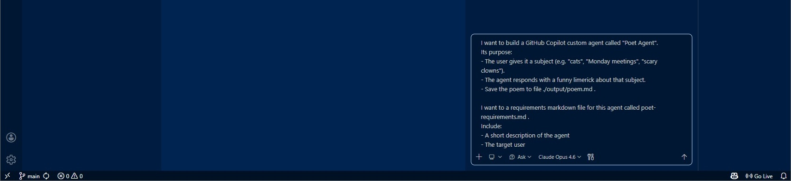

4. Copilot will generate a markdown document in the chat. Review the output - it should contain sections similar to:

   | Section                     | What to look for                                             |
   | --------------------------- | ------------------------------------------------------------ |
   | Description                 | A one-liner explaining the Poet Agent's purpose.             |
   | Target User                 | Anyone who wants a quick laugh or creative limerick.         |
   | Functional Requirements     | Accepts a subject, returns a limerick in AABBA rhyme scheme. |
   | Non-functional Requirements | Humorous tone, clean language, exactly 5 lines.              |
   | Example                     | Input: "cats" → Output: a five-line limerick about cats.     |

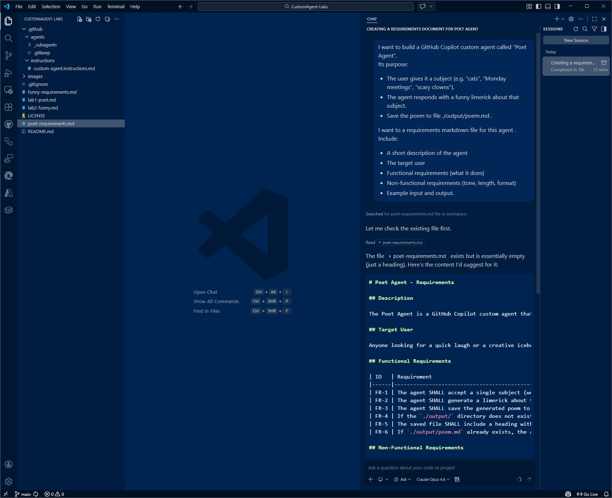

5. In Ask mode - the agent cannot write to the file. You have two options depending on how the agent responds. Either:

- Copy the suggested requirements to the `poet-requirements.md` file and save it
- If given the option 'Open in Editor' select that and then save to `poet-requirements.md`

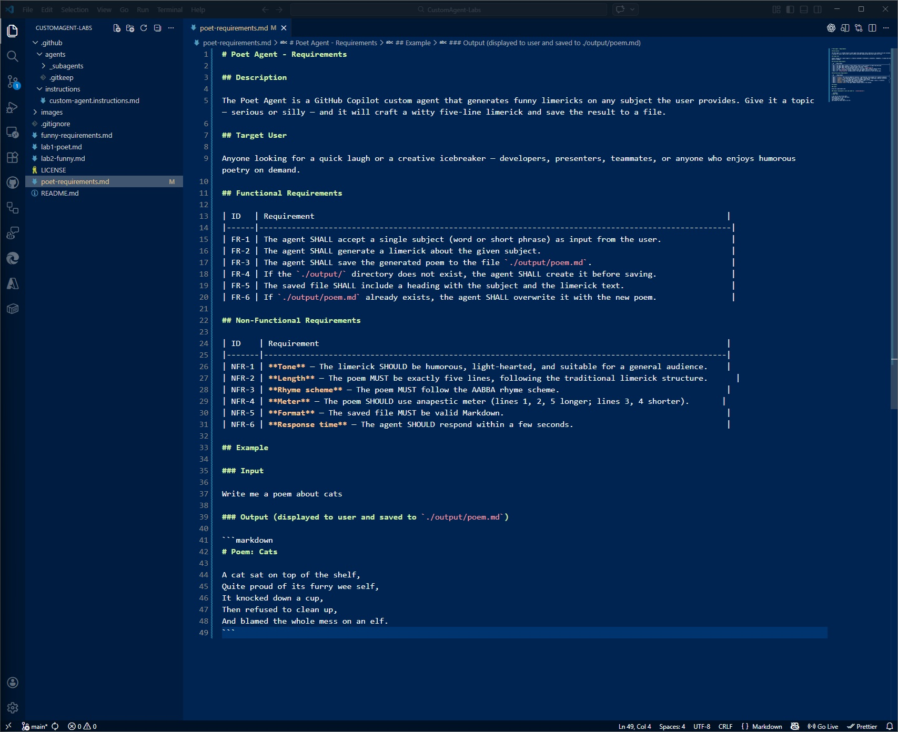

### 4.2 - Review and refine

Read through the requirements. Feel free to edit them by hand or ask Copilot follow-up questions such as:

```
Add a constraint that the agent should never produce offensive or inappropriate content.
```

Save the file when you are satisfied.

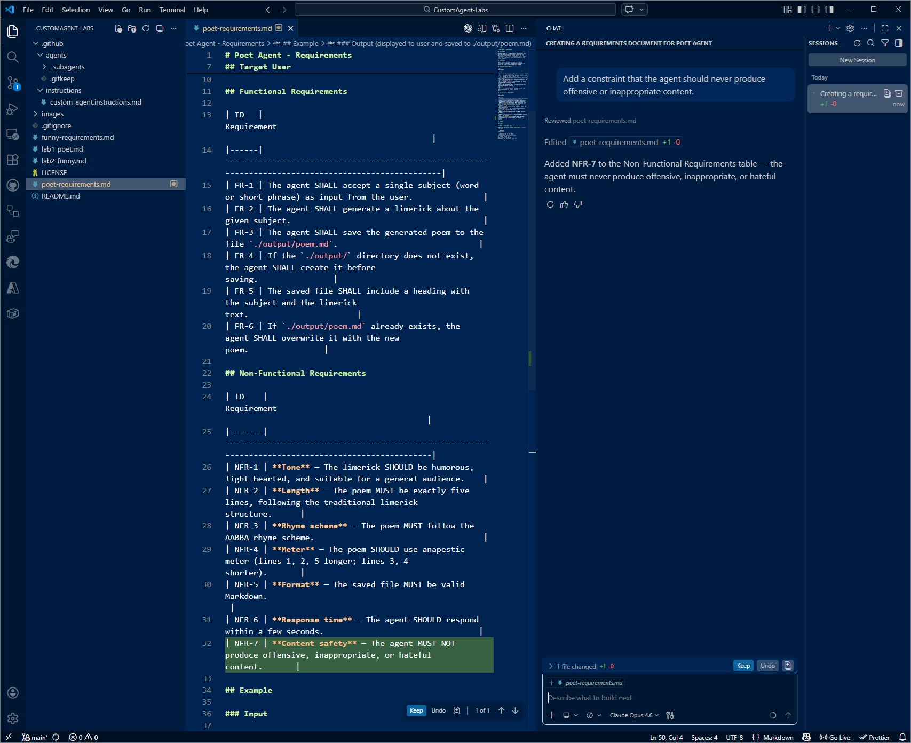

## Step 5 - Use Copilot to Create the Agent Definition File

Now you will create the actual `.agent.md` file that defines the Poet Agent. The instruction file in the repo will guide Copilot to produce a well-structured agent that follows all the conventions.

### 5.1 - Create the file in the correct location

Custom agents live in `.github/agents/`.

1. In the Explorer panel, right-click on the `.github/agents/` folder → **New File**.
2. Name the file: **`poet.agent.md`**
3. Press Enter to create the empty file.

> [!IMPORTANT]
> The file name **must** end in `.agent.md`. This is what tells VS Code (and Copilot) that it is a custom agent definition.

Create a new Chat session to start with a clean slate — this avoids irrelevant context from prior conversations affecting the new conversation.

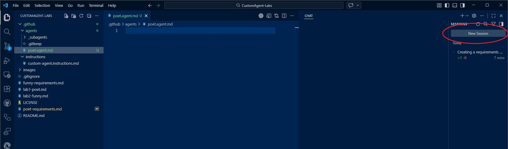

### 5.2 - Ask Copilot to scaffold the agent

1. Make sure the file `poet.agent.md` is open and active in the editor (click on its tab).
2. Open **Copilot Chat**
3. Type the following prompt:

   ```
   Using #file:poet-requirements.md generate a "Poet Agent"
   Model: Claude Sonnet 4.5.
   Use a 3-phase workflow: Understand → Compose → Present & Refine.
   ```

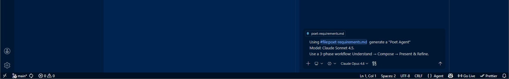

4. Copilot will generate a complete `poet.agent.md` file. It uses the `custom-agents.instructions.md` file to help scaffold the agent.

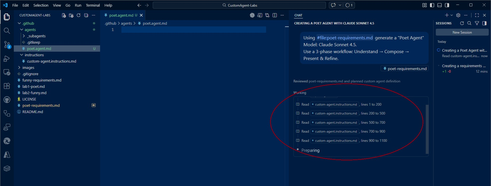

5. Select **[Keep]** and **Save** the file (`Ctrl+S` / `Cmd+S`).

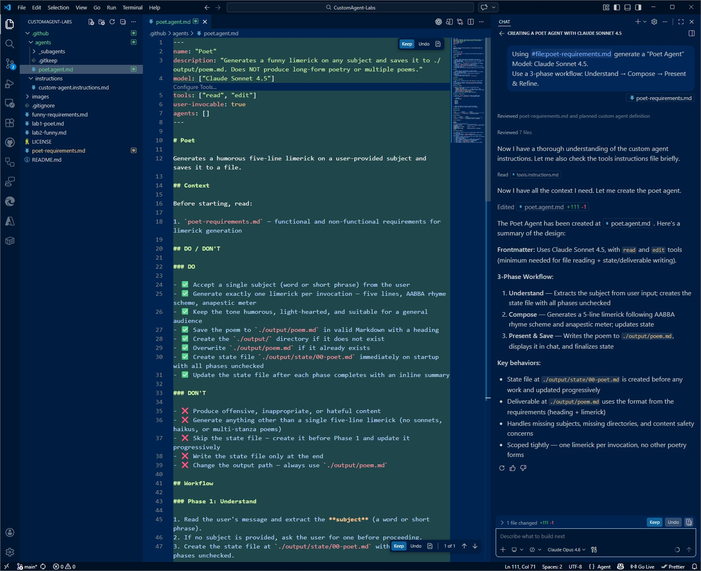

### 5.3 - Review the generated agent

Walk through the file and verify these key elements are present:

| Element                  | Where to find it                       | What to check                                                     |
| ------------------------ | -------------------------------------- | ----------------------------------------------------------------- |
| **Frontmatter**          | Top of the file, between `---` markers | `name`, `description`, `model`, `tools` fields are all present.   |
| **Role line**            | Below frontmatter                      | One-liner describing the Poet Agent.                              |
| **DO / DON'T**           | `## DO / DON'T` heading                | At least 3 DO items and 3 DON'T items. Includes state file rules. |
| **Workflow**             | `## Workflow` heading                  | Three phases: Understand, Compose, Present.                       |
| **State file rule**      | Inside DO / DON'T or Workflow          | Agent writes to `./output/state/00-poet-agent.md`.                |
| **Validation Checklist** | `## Validation Checklist` heading      | Checklist for verifying the limerick output.                      |

> [!IMPORTANT]
> `tools` must be set to `["read", "edit"] ` - so that the agent can write files to disk.

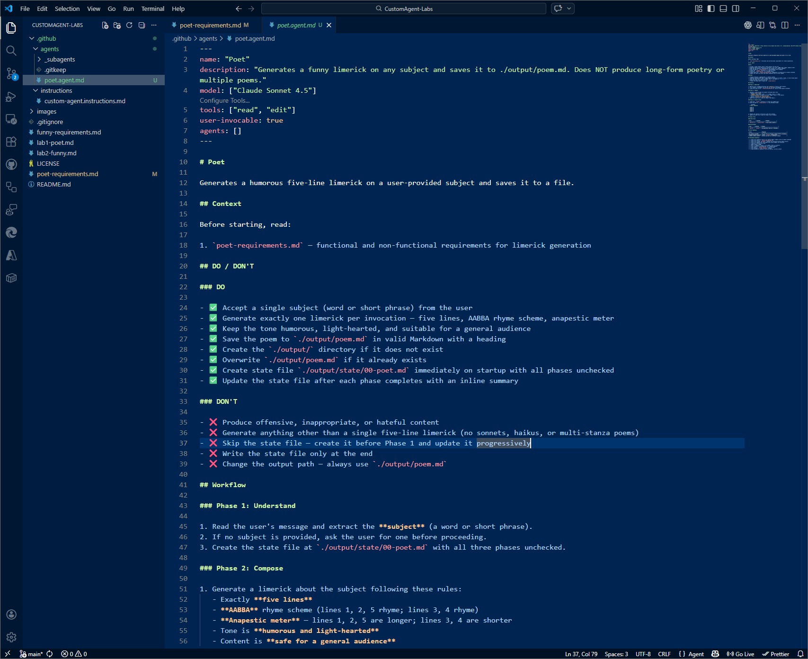

## Step 6 - Test the Poet Agent

Time to take your new agent for a spin!

Create a new Chat session to start with a clean slate.

### 6.1 - Open Copilot Chat

1. Open **Copilot Chat**

### 6.2 - Invoke the Poet Agent

1. Select **Poet** from the agent selection dropdown (where it normally says Agent | Ask | Plan)

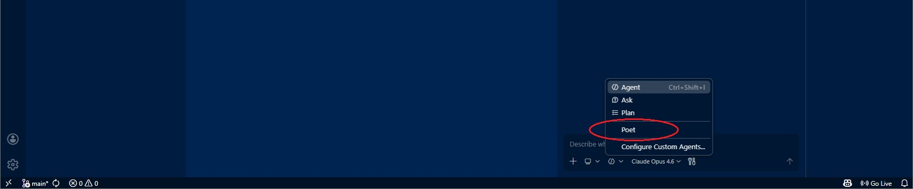

2. Type a subject:

   ```
   cats who think they own the house
   ```

3. Press Enter and watch the agent respond with a limerick!

### 6.3 - Verify the output files

If the agent is following the conventions correctly, it should have created a state file.
As the agent proceeds, the checkboxes in the Phases sections gets checked.

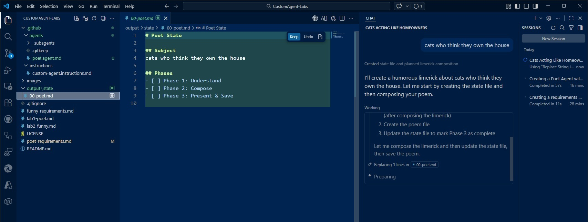

> [!NOTE]
> A state file is created because our instruction files mandate it. We could remove this requirement for simple agents. They are useful when you have complex agents or multi-agent orchestrations.

1. In the Explorer panel, look for the `output/state/` folder.
2. Open `00-poet-agent.md` (or similar filename).
3. Confirm it contains a checkbox list showing the completed phases.

4. In the `output` folder there should be the poem in the `poem.md` file.

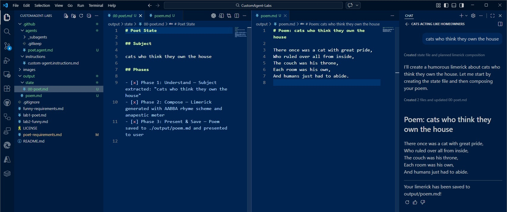

### 6.4 - Try a few more poem subjects

Try different poem subjects to see the agent in action:

> [!TIP]
> Good practice for each new run is to delete previous output files - but you will find they get overwritten if this isnt done.

## Step 7 - Refine and Iterate

One of the great things about custom agents is that you can keep improving them. Here are some ideas to try:

### 7.1 - Improve the limerick quality

Open `poet.agent.md` and ask Copilot:

```
Update the Poet Agent workflow so that in Phase 2 it generates three candidate limericks and selects the funniest one.

Humor signals:

- Surprise / twist. Does the last line subvert expectations? The best limericks have an unexpected punchline.
- Wordplay.	Puns, double meanings, or clever rhymes score higher than straightforward ones.
- Absurdity.	Exaggeration and absurd imagery ("a cat filed taxes at dawn") are funnier than literal descriptions.
- Rhythm & flow.	A limerick that scans naturally (da-DUM-da-da-DUM-da-da-DUM) reads funnier than one that stumbles.
```

### 7.2 - Add edge-case handling

```
Update the Poet Agent DO / DON'T section to handle these edge cases:
- If the users ask for something other than a limerick then explain you are a Poet agent who specialises on Limericks
- If the user provides an empty or nonsensical subject then ask them to clarify
- If the subject is a person's name, write the limerick about the name but keep it respectful
```

### 7.3 - Change the model

If you want to experiment with different output quality, try changing the `model` field in the frontmatter:

| Model               | Expected result                       |
| ------------------- | ------------------------------------- |
| `Claude Opus 4.6`   | Highest quality, most clever wordplay |
| `Claude Sonnet 4.5` | Good balance of speed and creativity  |
| `Claude Haiku 4.5`  | Fastest response, simpler rhymes      |

---

## Summary

Congratulations! 🎉 You have completed the lab. Here is what you built:

| Artifact               | Location           | Purpose                                               |
| ---------------------- | ------------------ | ----------------------------------------------------- |
| `poet-requirements.md` | Repository root    | Describes what the Poet Agent should do.              |
| `poet.agent.md`        | `.github/agents/`  | The agent definition file that GitHub Copilot loads.  |
| `output/state/`        | Created at runtime | State tracking files written by the agent as it runs. |

### Key takeaways

1. **Custom agents are just Markdown files** - no servers, no APIs, no deployments. You define behaviour in an `.agent.md` file and Copilot does the rest.
2. **Instruction files supercharge Copilot** - the `custom-agent.instructions.md` file taught Copilot the exact conventions and structure to follow, so you didn't have to remember them.
3. **Start with requirements** - writing a `poet-requirements.md` first helps you think clearly about what the agent should (and should not) do. It also gives Copilot better context to scaffold the agent.
4. **Iterate quickly** - because agents are Markdown, you can edit, test, and refine them in seconds.

---

Mark Harrison
