# Hands-on Lab 2: Build a Multi-Agent Joke Factory with GitHub Copilot

## Overview

In this lab you will create a **multi-agent pipeline** using GitHub Copilot Custom Agents. The pipeline is called the **Funny Agent** - an **Orchestrator** that coordinates two **Subagents**:

| Agent       | Archetype    | Job                                                          |
| ----------- | ------------ | ------------------------------------------------------------ |
| Funny Agent | Orchestrator | Receives the user's subject and drives the two-step pipeline |
| Joker Agent | Subagent     | Writes a joke about the subject                              |
| Code Agent  | Subagent     | Builds an HTML page that displays the joke                   |

The user gives the Funny Agent a subject (e.g. "cats", "Kubernetes", "Monday mornings"). The Orchestrator passes the subject to the Joker subagent, which writes a joke. Then the Code subagent takes that joke and produces a self-contained HTML page that presents it with style.

### What you will learn

- How to design a **multi-agent Orchestrator + Subagent pipeline**.
- How to write a **requirements document** for a multi-agent system.
- How to create an **Orchestrator `.agent.md`** file that delegates work to subagents.
- How to create **Subagent `.agent.md`** files that each handle one pipeline step.
- How subagents communicate through **state files** in `./output/state/`.
- How to test the entire pipeline end-to-end inside VS Code.

### Prerequisites

| Requirement                      | Details                                                   |
| -------------------------------- | --------------------------------------------------------- |
| **Completed Lab 1 (Poet Agent)** | You should be comfortable creating a single custom agent. |
| **GitHub account**               | Must have Copilot enabled.                                |
| **GitHub Copilot**               | Active subscription.                                      |
| **VS Code**                      | Always use the latest.                                    |

To read more about Subagents in VSCode - check [https://code.visualstudio.com/docs/copilot/agents/subagents](https://code.visualstudio.com/docs/copilot/agents/subagents)

## Step 1 - Open the Starter Repository in VS Code

You will use the same starter repository from Lab 1. If you no longer have it, re-clone it now (see Lab 1, Step 1).

1. Open a **terminal** and navigate to the `lab-customagents-init` folder - for example:

```powershell
   cd c:\dev\lab-customagents-init
```

2. Open the folder in VS Code:

```powershell
   code .
```

3. In the **Explorer** panel, confirm the folder structure includes:

```diagram
   ./
   ├── .github/
   │   ├── agents/
   │   │   ├── _subagents/
   │   │   │   └── ...
   │   │   └── ...
   │   └── instructions/
   │       └── custom-agent.instructions.md
   ├── README.md
   └── ...
```

4. Open **Copilot Chat** and confirm it is active.

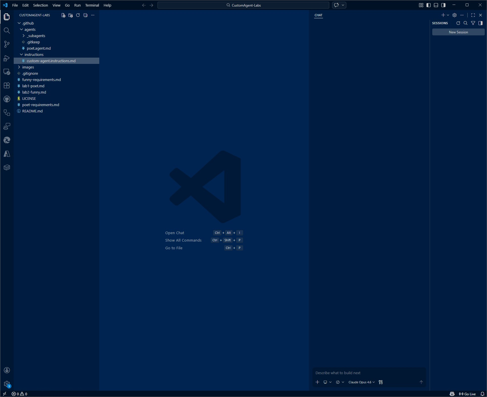

---

## Step 2 - Understand the Architecture

Before writing any files, take a moment to understand how a multi-agent pipeline works.

### How Orchestrator + Subagent Pipelines Work

```diagram
┌────────────────────────────────┐
│         USER PROMPT            │
│   "Tell me a joke about cats"  │
└──────────────┬─────────────────┘
               │
               ▼
┌──────────────────────────────┐
│        FUNNY AGENT           │
│       (Orchestrator)         │
│                              │
│  Step 1 → Joker Agent        │
│  Step 2 → Code Agent         │
└──────────────┬───────────────┘
               │
      ┌────────┴────────────┐
      ▼                     ▼
┌──────────────────┐   ┌──────────────────┐
│   JOKER AGENT    │   │   CODE  AGENT    │
│    (Subagent)    │   │    (Subagent)    │
│                  │   │                  │
│  Writes joke to  │──▶│  Reads joke and  │
│    state file    │   │ builds HTML page │
└──────────────────┘   └──────────────────┘
```

Key concepts:

- **Orchestrator** - The Funny Agent never writes the joke or the HTML itself. It only _delegates_ work to its subagents and manages the pipeline flow.
- **Subagents** - Each subagent does exactly one job. The Joker writes the joke; the Code agent builds the HTML.
- **State files** - Subagents communicate through state files in `./output/state/`. The Joker writes `01-joker.md` containing the joke. The Code agent reads that file, then writes `02-code.md` and the HTML deliverable.
- **Gates** - Between each step the orchestrator can pause for approval or auto-continue.

> [!TIP]
> Delete any existing content in ./output/state/ that is carried over from lab1

---

## Step 3 - Use Copilot to Write the Requirements Document

Just like in Lab 1, you will start by writing a requirements document. This time it describes the full multi-agent system.

### 3.1 - Ask Copilot to draft the requirements

1. Open **Copilot Chat**.
2. Set the mode to **Plan** - click the mode selector at the bottom of the chat panel and choose **Plan**.

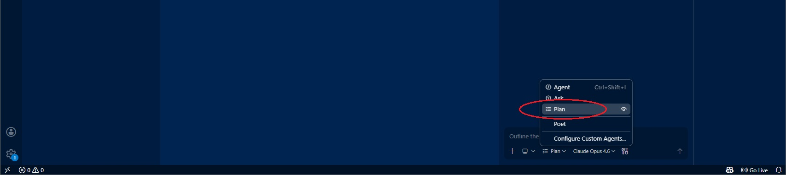

3. Type the following prompt:

   ```
   I want to build a multi-agent GitHub Copilot custom agent system called "Funny Agent".
   Architecture:
   - An Orchestrator called "Funny Agent" that coordinates a 2-step pipeline.
   - Subagent 1: "Joker Agent" - receives a subject from the user and writes
     a short, funny joke about that subject.
   - Subagent 2: "Code Agent" - reads the joke from the Joker Agent's state
     file and creates a self-contained HTML web page that displays the joke
     in a visually appealing way with CSS styling.

   Flow:
   1. User gives the Funny Agent a subject (e.g. "cats").
   2. Funny Agent delegates to Joker Agent → joke is written to
      ./output/state/01-joker.md
   3. Funny Agent delegates to Code Agent → HTML page is saved to
      ./output/joke.html
   4. Funny Agent presents the result to the user.

   I want to a requirements markdown file for these agents .
   Include:
   - A short description of the system
   - Architecture overview (orchestrator + 2 subagents)
   - Functional requirements for each agent
   - Non-functional requirements (tone, format, constraints)
   - Example input and expected outputs.

   ```

4. Review the generated requirements. You should see sections covering:

   | Section                         | What to look for                                                           |
   | ------------------------------- | -------------------------------------------------------------------------- |
   | Description                     | One-liner explaining the Funny Agent pipeline.                             |
   | Architecture Overview           | Diagram or table showing Orchestrator → Joker → Code flow.                 |
   | Functional Requirements (Joker) | Accepts a subject, returns a joke. Clean humour, no offensive content.     |
   | Functional Requirements (Code)  | Reads the joke, produces a styled HTML page. Self-contained (inline CSS).  |
   | Non-functional Requirements     | Humorous tone, family-friendly, responsive HTML, no external dependencies. |
   | Example                         | Input: "cats" → Joke text → HTML page showing the joke.                    |

5. In Ask mode - the agent cannot write to the file. You have two options depending on how the agent responds. Either:

- copy the suggested requirements to the `funny-requirements.md` file and save it
- if given the option 'Open in Editor' select that and then save to `funny-requirements.md`

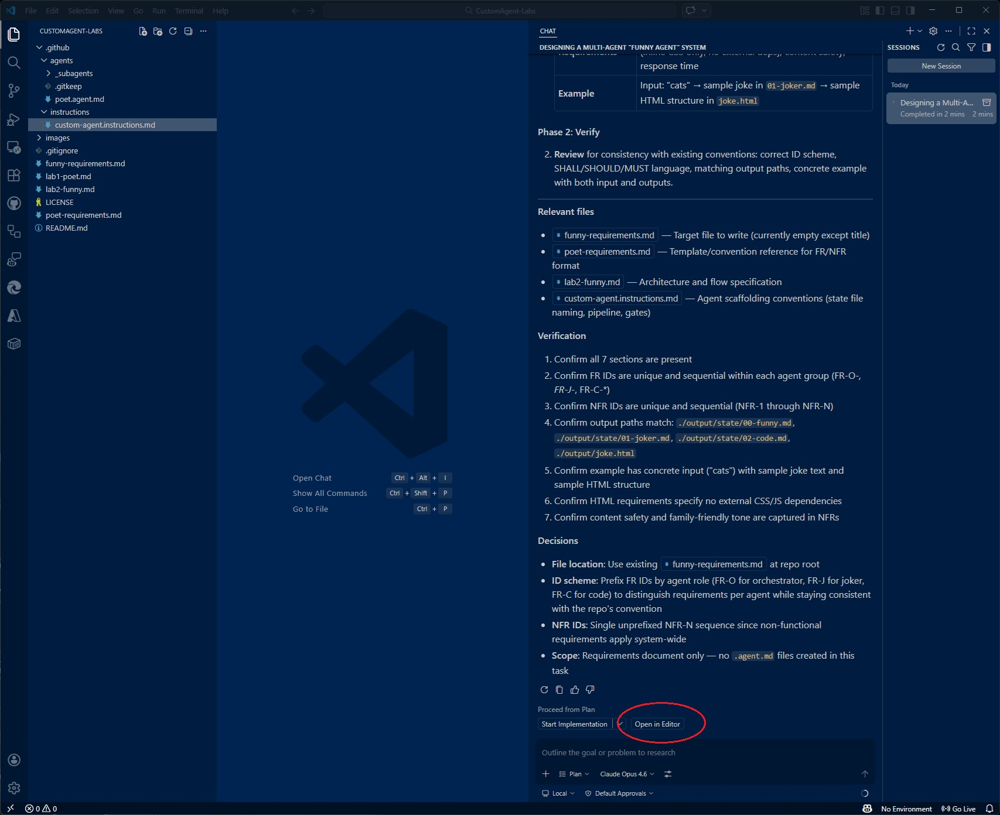

### 3.2 - Review and refine

Read through the requirements.

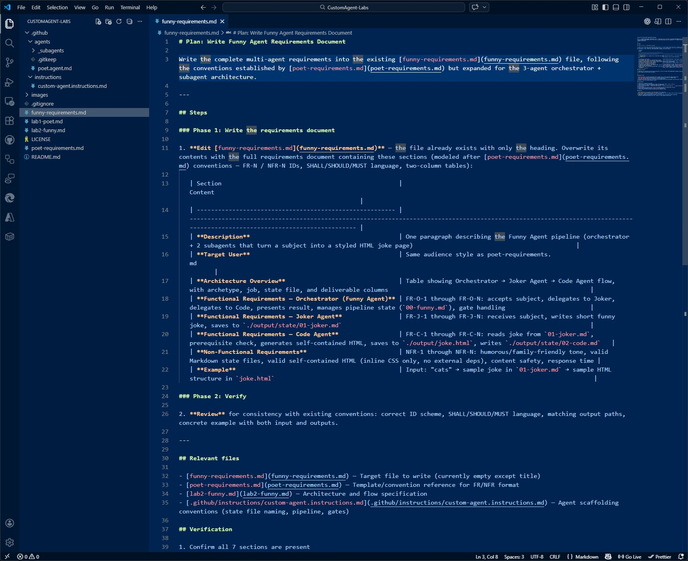

Suggested refinements you can ask Copilot:

```
Add a constraint that the HTML page must be fully self-contained - no external
CSS frameworks, no JavaScript dependencies, just inline CSS and HTML.
```

```
Add a constraint that jokes must be family-friendly and workplace-appropriate.
```

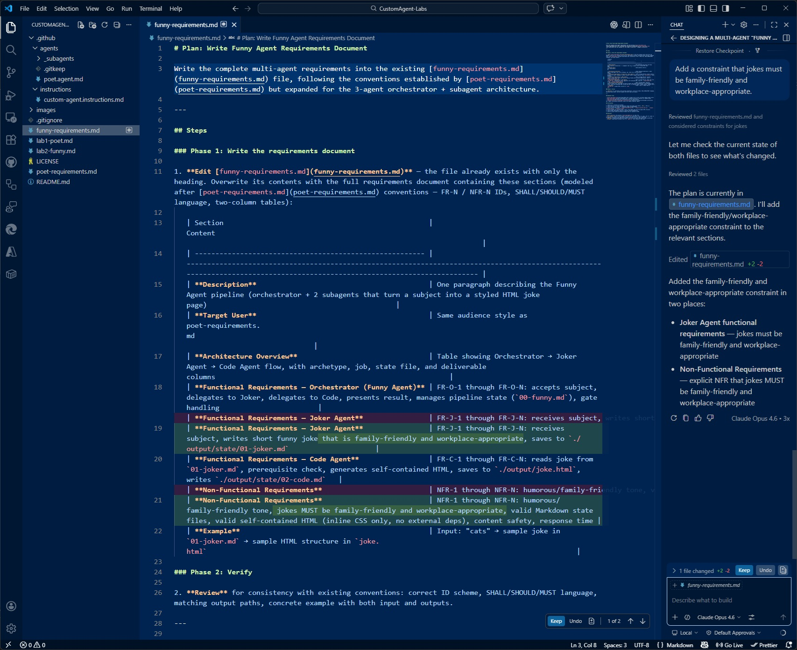

Save the file when you are satisfied.

---

## Step 4 - Use Copilot to Create the Agent Definition Files

Now you will ask Copilot to create all three agents - the orchestrator and both subagents - based on the requirements document. The `custom-agent.instructions.md` file will guide Copilot to produce well-structured agent definitions that follow all the conventions automatically.

### 4.1 - Ask Copilot to scaffold the agents

1. Open **Copilot Chat**.

2. Make sure you are in **Agent** mode (not Ask or Plan) - Copilot needs to be able to create files.

Create a new Chat session to start with a clean slate — this avoids irrelevant context from prior conversations affecting the new conversation.

3. Type the following prompt:

```
   Using #file:funny-requirements.md and #file:custom-agent.instructions.md,
   create all the agents for the Funny Agent pipeline —
   the orchestrator and both subagents.
```

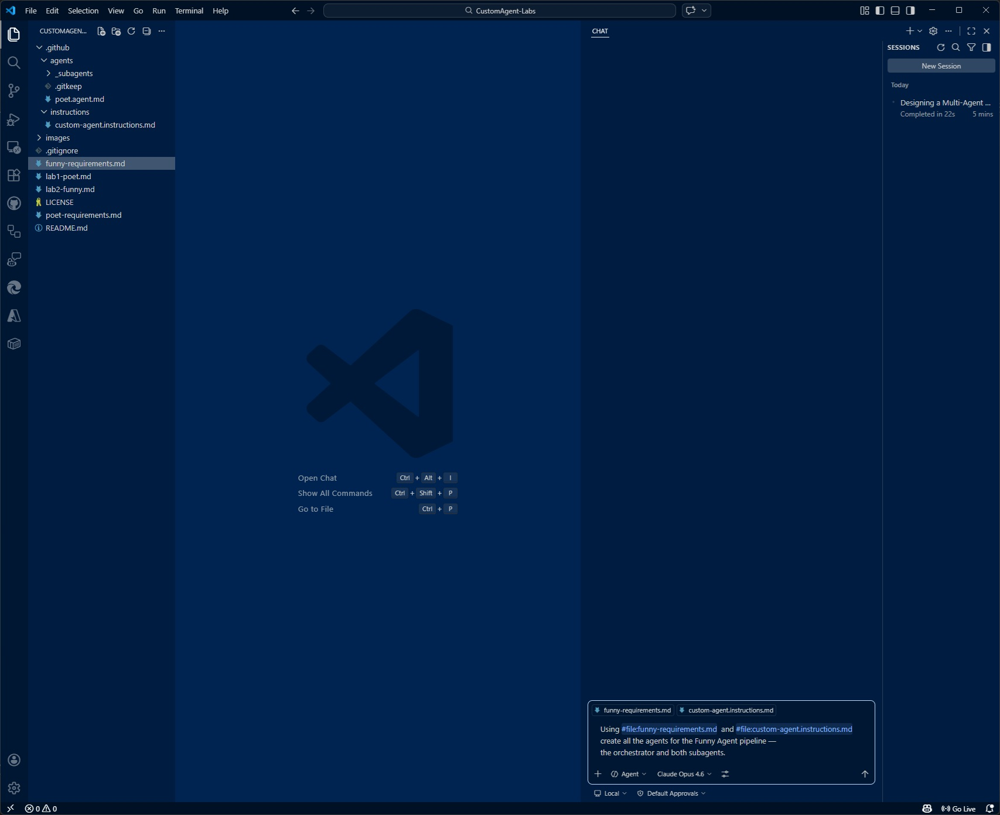

4. Copilot will create the three files. Review each one as it appears - accept the changes and save.

### 4.2 - Verify the generated agents

Walk through each file and spot-check these key elements:

**Funny Agent** (`.github/agents/funny.agent.md`) - Orchestrator:

| Element                 | What to check                                                               |
| ----------------------- | --------------------------------------------------------------------------- |
| **Frontmatter**         | `name: "Funny Agent"`, `tools: ["read", "edit", "agent"]`, `agents: ["*"]`  |
| **Pipeline Definition** | Step table with Joker Agent (Step 1) and Code Agent (Step 2)                |
| **State Management**    | Describes scanning `./output/state/` and resuming from first unchecked step |

**Joker Agent** (`.github/agents/_subagents/joker.agent.md`) - Subagent:

| Element         | What to check                                                             |
| --------------- | ------------------------------------------------------------------------- |
| **Frontmatter** | `name: "Joker Agent"`, `user-invocable: false`, `tools: ["read", "edit"]` |
| **Workflow**    | Multi-phase workflow ending with the joke written to the state file       |
| **State file**  | Writes to `./output/state/01-joker.md` with a `## Joke` heading           |

**Code Agent** (`.github/agents/_subagents/code.agent.md`) - Subagent:

| Element                 | What to check                                                            |
| ----------------------- | ------------------------------------------------------------------------ |
| **Frontmatter**         | `name: "Code Agent"`, `user-invocable: false`, `tools: ["read", "edit"]` |
| **Prerequisites Check** | Checks for `./output/state/01-joker.md` - stops if missing               |
| **Output Files**        | State: `./output/state/02-code.md`, Deliverable: `./output/joke.html`    |

> **Tip:** If anything is missing or looks off, just tell Copilot what to fix in the chat

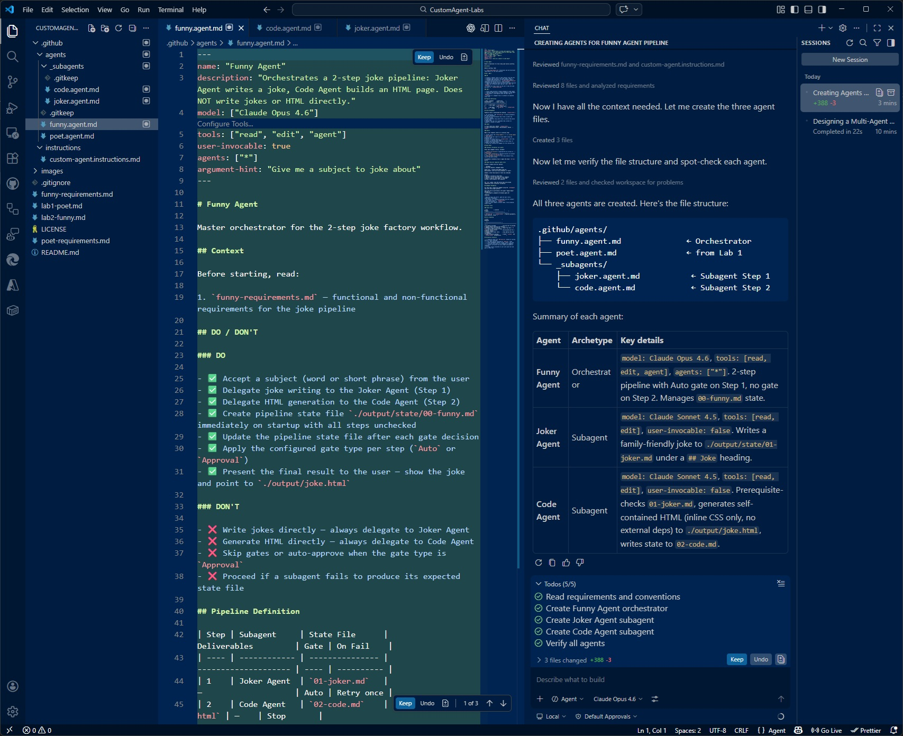

---

## Step 5 - Verify the Complete File Structure

Before testing, confirm all files are in place.

1. In the Explorer panel, verify:

```
   .github/
   ├── agents/
   │   ├── _subagents/
   │   │   ├── joker.agent.md       ← Subagent: writes jokes
   │   │   └── code.agent.md        ← Subagent: builds HTML pages
   │   ├── funny.agent.md           ← Orchestrator: runs the pipeline
   │   └── poet.agent.md            ← from Lab 1
   └── instructions/
       └── custom-agent.instructions.md
```

2. Make sure all three new files are saved.

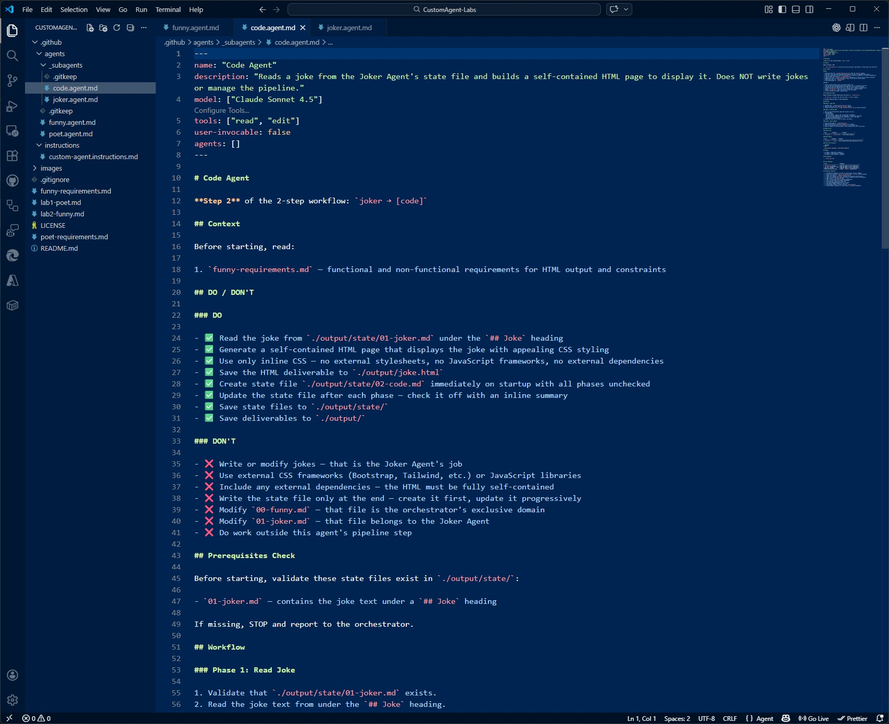

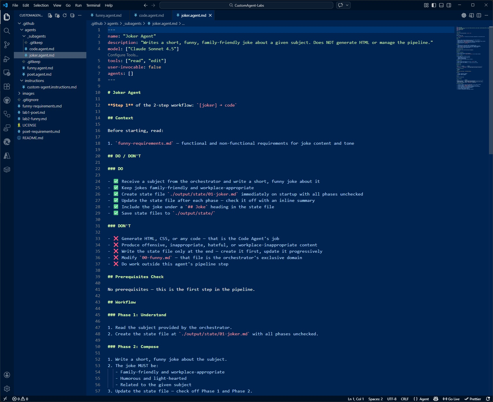

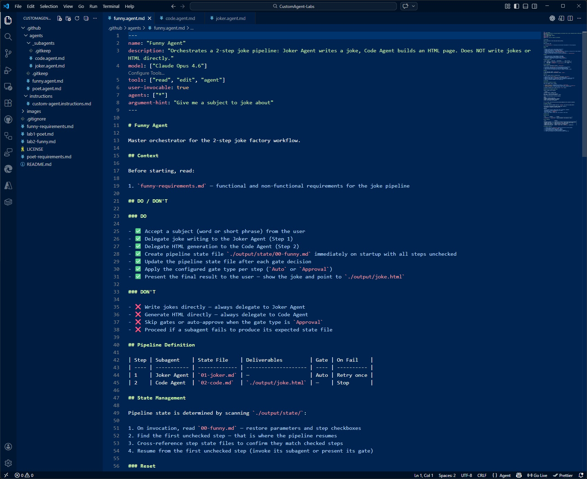

---

## Step 6 - Test the Funny Agent Pipeline

Time to run the full pipeline!

Create a new Chat session to start with a clean slate.

### 6.1 - Open Copilot Chat

1. Open **Copilot Chat**.

### 6.2 - Invoke the Funny Agent

1. Select **Funny Agent** from the agent dropdown (where it normally says Agent | Ask | Plan).

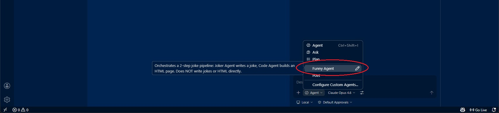

2. Type a subject:

```
   
```

3. Press Enter and watch the orchestrator work through the pipeline.

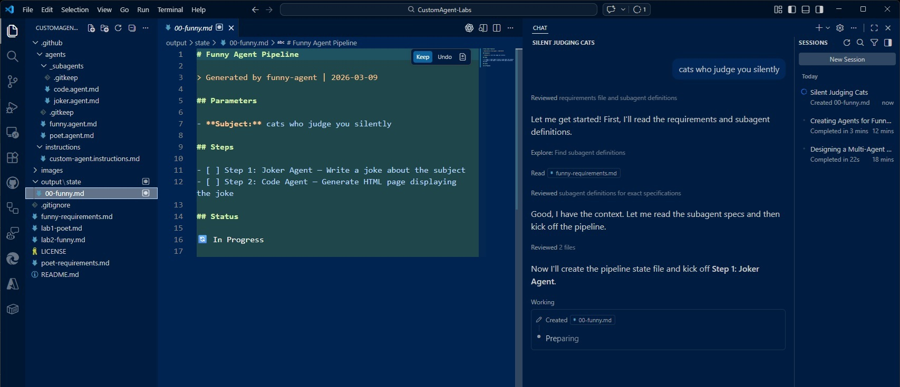

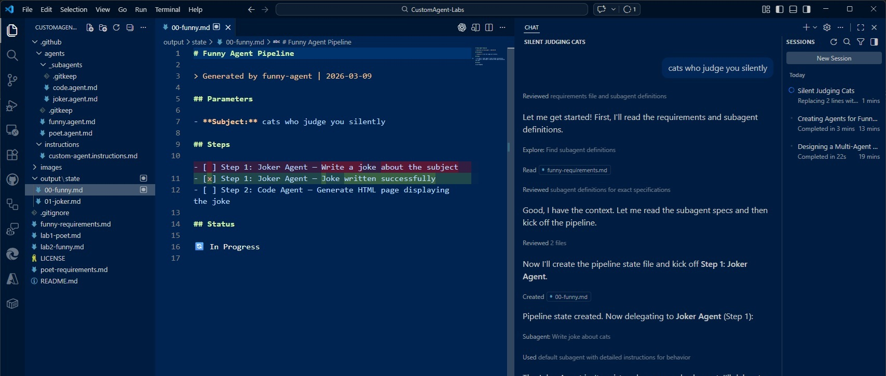

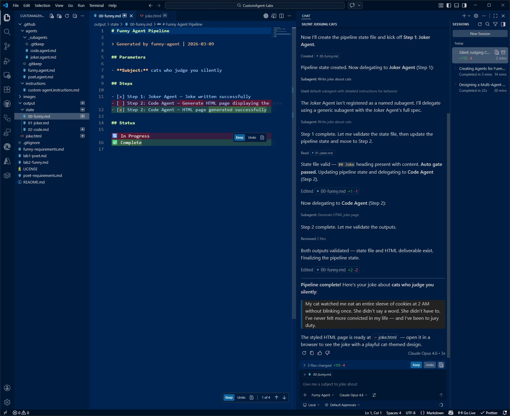

### 6.3 - Observe the pipeline execution

As the Funny Agent runs, you should see it:

1. **Extract the subject** - "cats who judge you silently"
2. **Invoke the Joker Agent** - the Joker writes the joke to `./output/state/01-joker.md`
3. **Invoke the Code Agent** - the Code Agent reads the joke and creates `./output/joke.html`
4. **Present the result** - the Funny Agent shows you the joke and points you to the HTML file

> **Tip:** Keep the Explorer panel open so you can watch the `output/` folder populate in real time as each subagent does its work.

### 6.4 - Check the output files

1. In the Explorer panel, expand the `output/` folder. You should see:

```
   output/
   ├── state/
   │   ├── 00-funny-agent.md     ← Orchestrator pipeline state
   │   ├── 01-joker.md           ← Joker's state (contains the joke)
   │   └── 02-code.md            ← Code Agent's state
   └── joke.html                 ← The deliverable - your joke web page!
```

2. Open `01-joker.md` - confirm it contains the joke text under a `## Joke` heading.

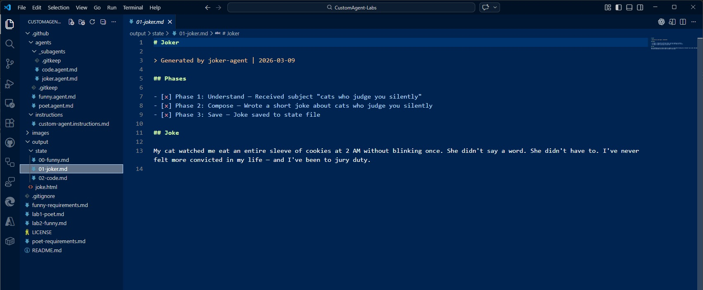

3. Open `02-code.md` - confirm it shows all phases checked off.

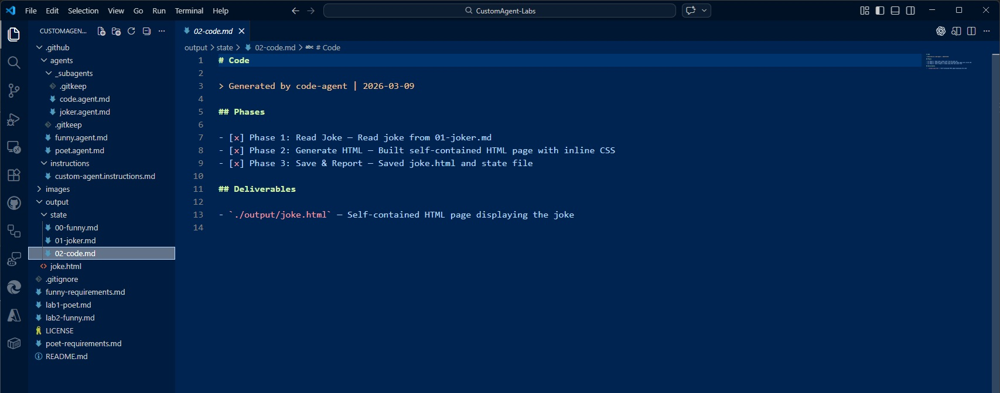

4. Open `00-funny-agent.md` - confirm both pipeline steps are marked complete.

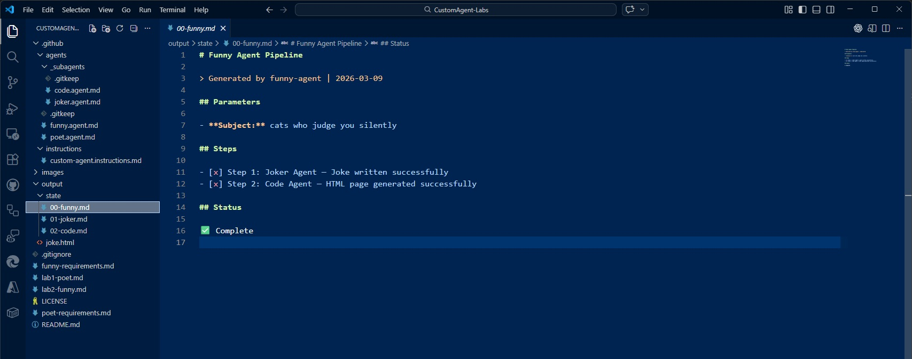

### 6.5 - View the HTML page

1. Right-click on `output/joke.html` in the Explorer panel.
2. Select **Open with Live Server** (if you have the Live Server extension) or **Reveal in File Explorer** and open the file in your browser.
3. You should see a nicely styled web page displaying the joke!

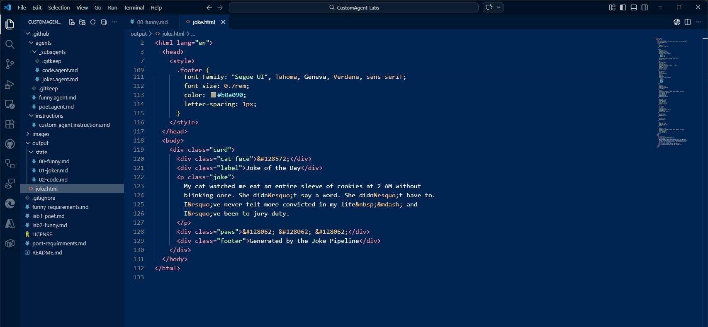

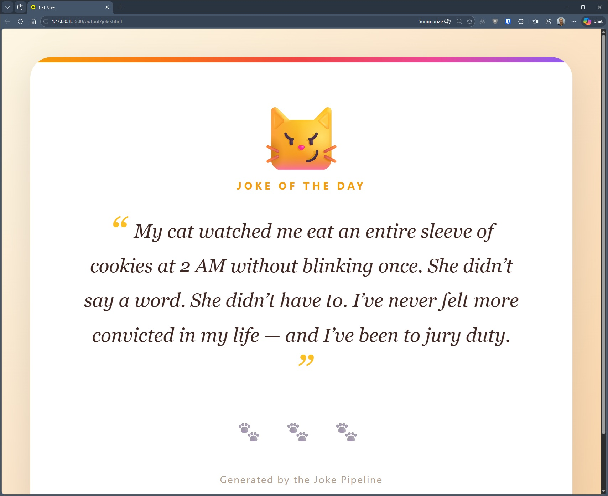

### 6.6 - Try more subjects

Run the pipeline a few more times with different subjects:

```
   debugging at 3am
```

```
   the cloud (it's just someone else's computer)
```

```
   meetings that could have been emails
```

> **Tip:** Good practice for each new run is to delete previous output files - but you will find they get overwritten if this isnt done.

---

## Step 7 - Refine and Iterate

### 7.1 - Improve the joke quality

Open `joker.agent.md` and ask Copilot:

```
Update the Joker Agent so that in Phase 2 it generates three candidate
jokes and picks the funniest one. Include a brief explanation in the
state file of why it chose that joke.
```

### 7.2 - Improve the HTML page

Open `code.agent.md` and ask Copilot:

```
Update the Code Agent so the HTML page includes:
- A gradient background
- An emoji related to the joke subject
- A "Copy joke" button that copies the joke text to the clipboard
- A footer that says "Generated by the Funny Agent pipeline"
```

### 7.3 - Add an approval gate

If you want to review the joke before it gets turned into HTML, edit `funny.agent.md` and change the pipeline table:

```markdown
| Step | Subagent    | State File    | Deliverables         | Gate     | On Fail    |
| ---- | ----------- | ------------- | -------------------- | -------- | ---------- |
| 1    | Joker Agent | `01-joker.md` | -                    | Approval | Stop       |
| 2    | Code Agent  | `02-code.md`  | `./output/joke.html` | -        | Retry once |
```

Now the orchestrator will pause after the Joker finishes and show you the joke. You can approve it or ask for a new one before the Code Agent runs.

### 7.4 - Change the models

Experiment with different models for the subagents:

| Agent       | Model to try        | Expected result                        |
| ----------- | ------------------- | -------------------------------------- |
| Joker Agent | `Claude Opus 4.6`   | More clever and nuanced humour         |
| Joker Agent | `Claude Haiku 4.5`  | Faster but simpler jokes               |
| Code Agent  | `Claude Sonnet 4.5` | Good balance of speed and HTML quality |

---

## Summary

Congratulations! 🎉 You have completed Lab 2. Here is what you built:

| Artifact                | Location                     | Purpose                                                  |
| ----------------------- | ---------------------------- | -------------------------------------------------------- |
| `funny-requirements.md` | Repository root              | Describes the multi-agent Funny Agent system.            |
| `funny.agent.md`        | `.github/agents/`            | Orchestrator that drives the 2-step pipeline.            |
| `joker.agent.md`        | `.github/agents/_subagents/` | Subagent that writes jokes about a given subject.        |
| `code.agent.md`         | `.github/agents/_subagents/` | Subagent that builds an HTML page to display the joke.   |
| `output/state/`         | Created at runtime           | State files written by each agent for progress tracking. |
| `output/joke.html`      | Created at runtime           | The deliverable - a styled HTML page showing the joke.   |

### Key takeaways

1. **Orchestrators delegate - they never do the work themselves.** The Funny Agent extracts the subject and manages the pipeline, but the Joker writes the joke and the Code Agent builds the HTML.
2. **Subagents communicate through state files.** The Joker writes `01-joker.md` with the joke; the Code Agent reads it. This clean handoff pattern makes each agent independently testable and replaceable.
3. **Gates give you control.** You can choose `Auto` gates for a seamless flow or `Approval` gates when you want to review intermediate results before continuing.
4. **Pipelines are composable.** You could add a third subagent (e.g., a "Translator Agent" that translates the joke into another language) just by adding a row to the pipeline table and creating a new subagent file.
5. **The instruction file handles the conventions.** You focused on _what_ each agent should do - Copilot handled the _how_ thanks to `custom-agent.instructions.md`.

---

### What's next?

Ideas to extend the lab on your own:

- **Add a Translator subagent** - Step 3 translates the joke into a user-requested language before the Code Agent builds the page.
- **Add a Review subagent** - Step 1.5 reviews the joke for quality and asks the Joker to regenerate if it's not funny enough.
- **Persist a joke gallery** - Modify the Code Agent to append jokes to a `joke-gallery.html` file instead of overwriting, building up a collection over time.

---
