# Hands-on Lab 3: Build a Quiz Generator Agent with Skills

## Overview

In this lab you will create a **GitHub Copilot Custom Agent** called the **Quiz Agent**. When a user invokes this agent, it generates a 5-question multiple-choice quiz on any subject they provide, then produces a set of slides — either as a **PowerPoint** presentation or **HTML slides** — depending on the user's choice.

This lab introduces two new concepts:

- **Skills** — reusable capabilities that agents can leverage (in this case, skills for creating PowerPoint files and HTML slide decks).
- **Interactive prompts** — using the VS Code `vscode/askQuestions` tool to ask the user which output format they prefer.

> [!NOTE]
> Custom agents declare the tools they need in the `tools:` array in their YAML frontmatter. This is the same mechanism used for both **built-in VS Code tools** (like `read`, `edit`, `vscode/askQuestions`, `runInTerminal`) and **MCP tools** (like `mcp_serverName_toolName`). From the agent's perspective, all tools are invoked the same way — the only difference is that built-in tools are always available, while MCP tools require an external MCP server to be configured and running.

### What you will learn

- How to install and configure **skills** for use with custom agents.
- How to use the VS Code **`vscode/askQuestions`** tool to prompt the user for input during agent execution.
- How to create an agent that generates structured quiz content with multiple-choice answers.
- How to produce multiple output formats (PowerPoint and HTML slides) from the same agent.

### Prerequisites

| Requirement                   | Details                                                                                                                                                     |
| ----------------------------- | ----------------------------------------------------------------------------------------------------------------------------------------------------------- |
| **Completed Lab 1 and Lab 2** | You should be comfortable creating custom agents.                                                                                                           |
| **GitHub account**            | Must have Copilot enabled.                                                                                                                                  |
| **GitHub Copilot**            | Active subscription.                                                                                                                                        |
| **VS Code**                   | Always use the latest.                                                                                                                                      |
| **Node.js**                   | Required for installing skills via `npx` and for creating PowerPoint files (via `pptxgenjs`).                                                               |
| **Python** _(optional)_       | Only needed if you want advanced PowerPoint QA features (thumbnail generation, text extraction). Not required for HTML slides or basic PowerPoint creation. |

---

## Step 1 - Open the Starter Repository in VS Code

You will use the same repository from Labs 1 and 2. If you no longer have it, re-clone it now (see Lab 1, Step 1).

1. Open a **terminal** and navigate to the `lab-customagents-init` folder — for example:

```powershell
   cd c:\dev\lab-customagents-init
```

2. Open the folder in VS Code:

```powershell
   code .
```

3. In the **Explorer** panel, confirm the folder structure includes:

```diagram
   ./
   ├── .github/
   │   ├── agents/
   │   │   ├── _subagents/
   │   │   │   └── ...
   │   │   └── ...
   │   └── instructions/
   │       └── custom-agent.instructions.md
   ├── README.md
   └── ...

```

4. Open **Copilot Chat** and confirm it is active.

---

## Step 2 - Install the Skills

This lab uses two external **skills** that give the Quiz Agent the ability to create PowerPoint presentations and HTML slide decks. Skills are reusable packages of domain knowledge that agents can leverage to produce high-quality output.

> [!NOTE]
> **Agents vs Skills:** A **custom agent** is an autonomous persona that the user invokes directly — it has its own name, model, tools, and workflow, and it drives a conversation to produce output. A **skill** is a passive package of domain knowledge (typically a `SKILL.md` file) that an agent can _read_ to learn how to do something it wouldn't otherwise know — like how to create a PowerPoint file or build an HTML slide deck. Skills don't run on their own; they only take effect when an agent reads and follows their instructions. Think of an agent as the chef and a skill as the recipe.

You can browse a growing catalog of community skills at [https://skills.sh](https://skills.sh) — it's a good place to discover skills for common tasks before writing your own.

In this lab we use **two** skills because the Quiz Agent supports two different output formats — and each format requires specialist knowledge that the agent doesn't have on its own:

| Skill               | What it teaches the agent                                                                                 |
| ------------------- | --------------------------------------------------------------------------------------------------------- |
| **pptx**            | How to create well-structured PowerPoint `.pptx` files — slide layouts, text positioning, and formatting. |
| **frontend-slides** | How to build HTML slide decks — responsive layouts, navigation between slides, and CSS styling.           |

The Quiz Agent generates the same quiz content regardless of format. The skill it reads determines _how_ that content gets turned into slides. Without these skills, the agent would have no idea how to produce a valid `.pptx` file or a navigable HTML slide deck.

### 2.1 - Install the skills

1. Open a **terminal** in VS Code (`` Ctrl+` `` or **Terminal → New Terminal**).

2. Run the following commands to install both skills:

```powershell
npx skills add https://github.com/anthropics/skills --skill pptx --agent github-copilot -y

npx skills add https://github.com/zarazhangrui/frontend-slides --skill frontend-slides --agent github-copilot -y

```

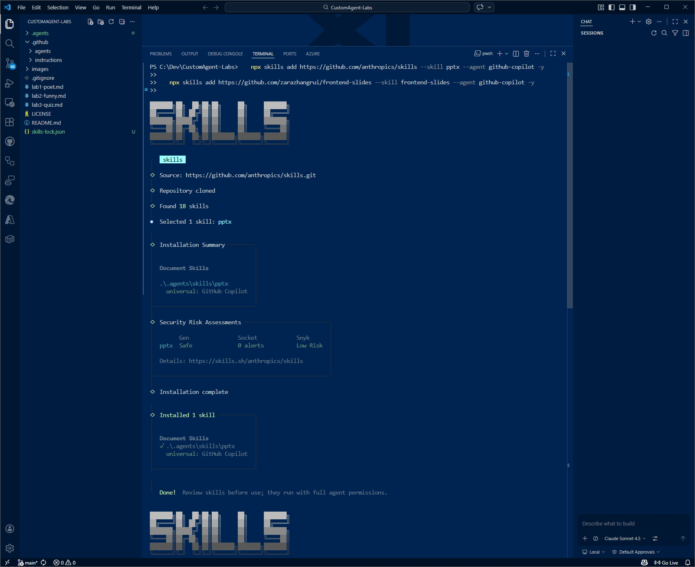

3. Move the installed skills into the `.github/skills` folder (our project convention). For PowerShell:

```powershell
   robocopy .\.agents\skills .\.github\skills /E /MOVE /NFL /NDL
   Remove-Item -Recurse -Force .\.agents

```

### 2.2 - Verify the skills are installed

1. In the **Explorer** panel, expand `.github/skills/`. You should see the skills hacve been addded

```diagram
   ./
   ├── .github/
   │   ├── agents/
   │   │   ├── _subagents/
   │   │   │   └── ...
   │   │   └── ...
   │   ├── instructions/
   │   │   └── custom-agent.instructions.md
   │   └── skills/
   │       ├── pptx/
   │       │   └── ...
   │       └── frontend-slides/
   │           └── ...
   ├── README.md
   └── ...

```

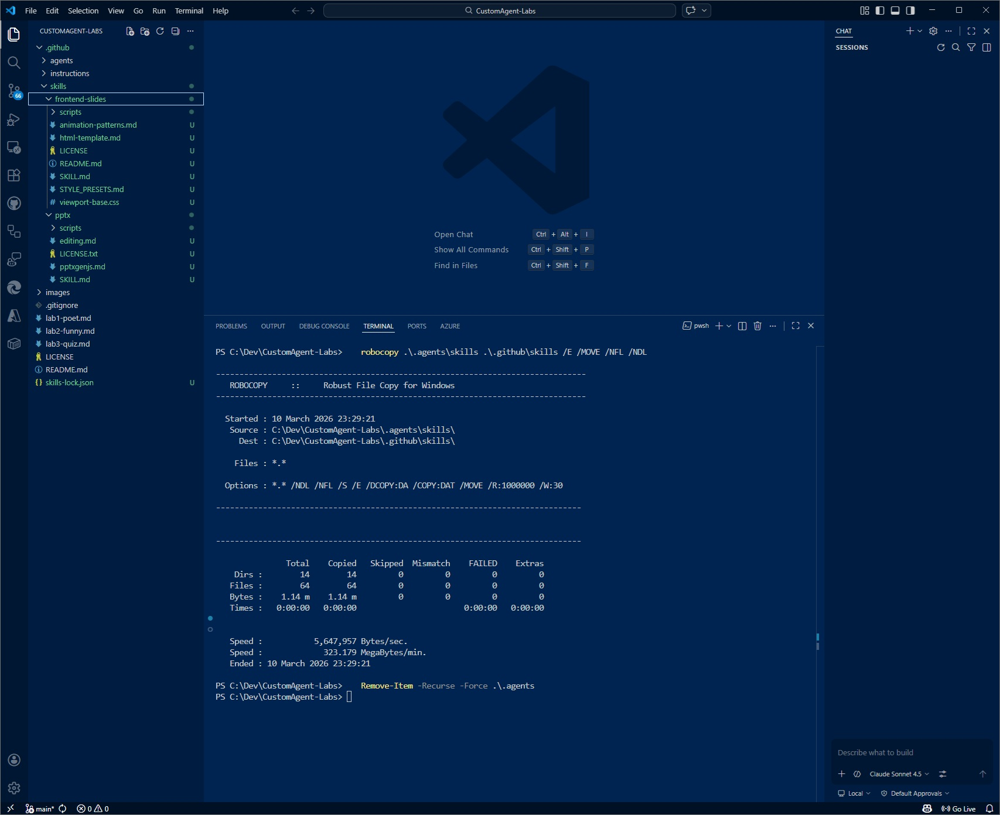

2. Take a minute to browse the skill files. Each skill folder contains:
   - A **`SKILL.md`** file — the main instructions that tell the agent what to do and how to do it.
   - **Supporting documents** — additional markdown guides with detailed techniques (e.g. `pptxgenjs.md` for PowerPoint creation from scratch, `STYLE_PRESETS.md` for HTML slide themes).
   - **CSS/code files** — reusable assets the agent can include in its output (e.g. `viewport-base.css` for responsive slide layouts).
   - **Scripts** — helper scripts the agent can run during execution (e.g. Python scripts for thumbnail generation or content extraction).

   The agent reads these files at runtime and follows the instructions to produce high-quality output — without these files, it would be guessing at file formats and best practices.

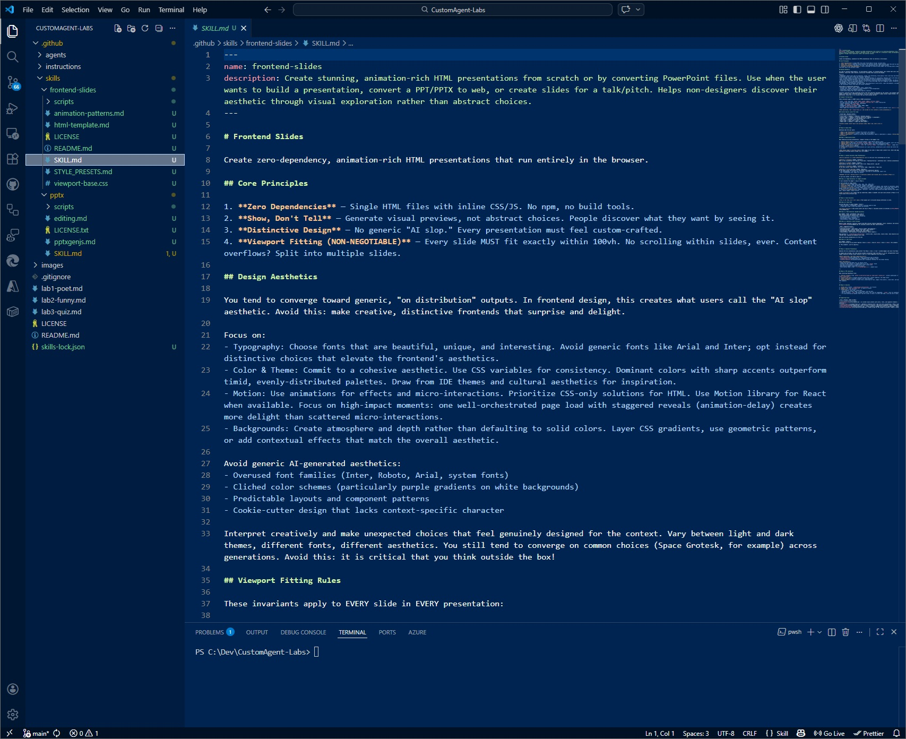

---

## Step 3 - Use Copilot to Write the Requirements Document

Just like in the previous labs, you will start by describing _what_ the agent should do in a requirements document.

### 3.1 - Ask Copilot to draft the requirements

1. Open **Copilot Chat**.
2. Set the mode to **Plan** — click the mode selector at the bottom of the chat panel and choose **Plan**.

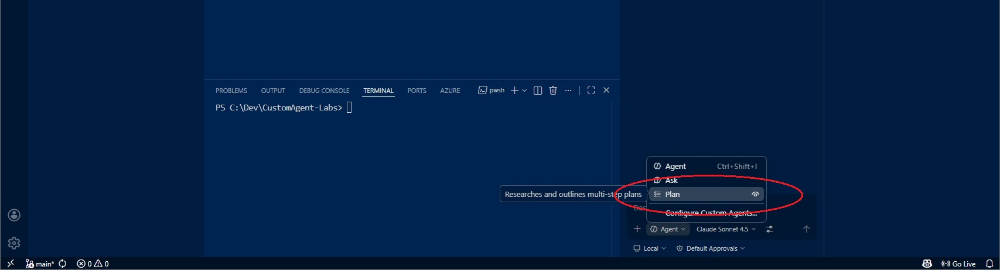

3. Type the following prompt into the chat:

   ```
   I want to build a GitHub Copilot custom agent called "Quiz Agent".
   Its purpose:
   - The user gives it a subject (e.g. "General Knowledge", "Science","History of Computing").
   - The agent generates 5 multiple-choice questions on that subject.
   - Each question has 4 answer options:
     - 1 correct answer
     - 1 funny/absurd wrong answer
     - 2 plausible but incorrect wrong answers
   - The agent creates 11 slides:
     - A title slide showing the quiz subject
     - For each question: a question slide followed by an answer slide
       (1 title + 5 questions × 2 slides = 11 slides)
   - The slides can be produced as either PowerPoint (.pptx) or HTML slides
     - For PowerPoint output, the agent uses the pptx skill (in .github/skills/pptx/)
     - For HTML output, the agent uses the frontend-slides skill (in .github/skills/frontend-slides/)
   - The agent should ask the user which format they prefer using the
     VS Code 'vscode/askQuestions' tool
   - If the user asks for a quiz on a nonsensical subject, the agent should politely
     decline and ask for a sensible topic

   I want a requirements markdown file for this agent.
   Include:
   - A short description of the agent
   - The target user
   - Functional requirements (what it does)
   - Non-functional requirements (tone, format, constraints)
   - Output format options
   - Example input and output

   ```

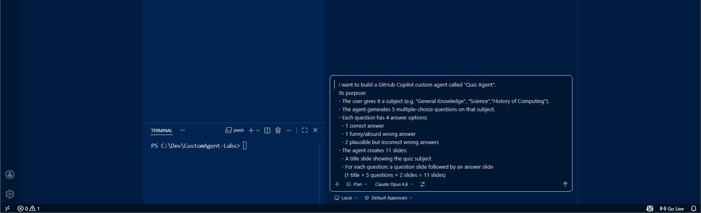

4. Copilot will generate a markdown document in the chat. **Review the output** — it should contain sections similar to:

   | Section                     | What to look for                                                             |
   | --------------------------- | ---------------------------------------------------------------------------- |
   | Description                 | A one-liner explaining the Quiz Agent's purpose.                             |
   | Target User                 | Anyone who wants to generate a fun quiz on a topic.                          |
   | Functional Requirements     | 5 questions, 4 answers each (1 correct, 1 funny, 2 plausible), 11 slides.    |
   | Non-functional Requirements | Family-friendly, clear formatting, correct answers must actually be correct. |
   | Output Format Options       | PowerPoint (.pptx) via pptx skill or HTML slides via frontend-slides skill.  |
   | Example                     | Input: "General Knowledge" → 5 questions with answers → 11 slides.           |

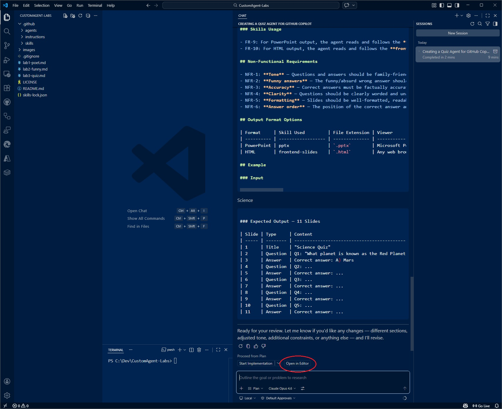

5. In Plan mode — the agent cannot write to the file. You have two options depending on how the agent responds. Either:

- copy the suggested requirements to the `quiz-requirements.md` file and save it
- if given the option 'Open in Editor' select that and then save to `quiz-requirements.md`

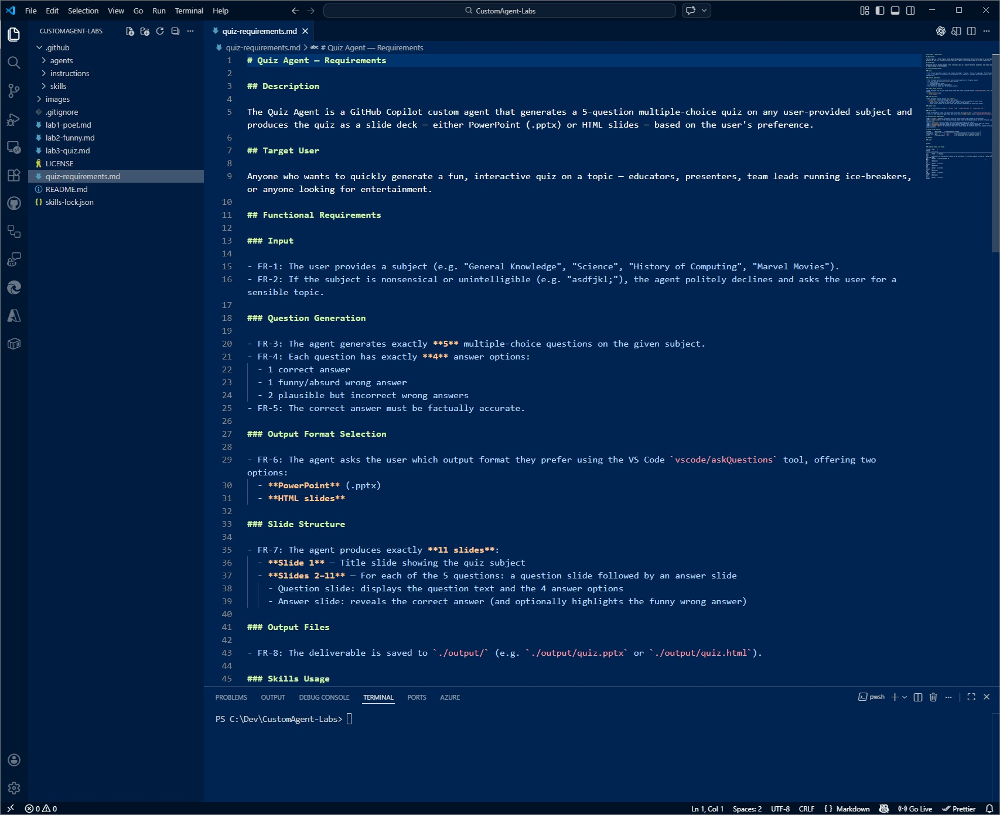

### 3.2 - Review and refine

Read through the requirements. Feel free to edit them by hand or ask Copilot follow-up questions.

Save the file when you are satisfied.

---

## Step 4 - Use Copilot to Create the Agent Definition File

Now you will create the actual `.agent.md` file that defines the Quiz Agent. The instruction file in the repo will guide Copilot to produce a well-structured agent that follows all the conventions.

### 4.1 - Create the file in the correct location

Custom agents live in `.github/agents/`.

1. In the Explorer panel, right-click on the `.github/agents/` folder → **New File**.
2. Name the file: **`quiz.agent.md`**
3. Press Enter to create the empty file.

> [!IMPORTANT]
> The file name **must** end in `.agent.md`. This is what tells VS Code (and Copilot) that it is a custom agent definition.

Create a new Chat session to start with a clean slate — this avoids irrelevant context from prior conversations affecting the new conversation.

### 4.2 - Ask Copilot to scaffold the agent

1. Make sure the file `quiz.agent.md` is **open and active** in the editor (click on its tab).
2. Open **Copilot Chat** and make sure you are in **Agent** mode (not Ask or Plan) — Copilot needs to be able to create files.
3. Type the following prompt:

   ```
    Using #file:quiz-requirements.md and #file:custom-agent.instructions.md
    generate a "Quiz Agent" using Claude Sonnet 4.5.

   ```

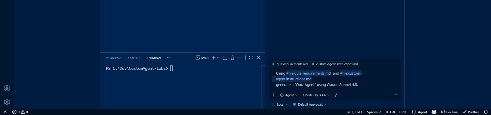

4. Copilot will generate a complete `quiz.agent.md` file. It uses the `custom-agents.instructions.md` file to help scaffold the agent.

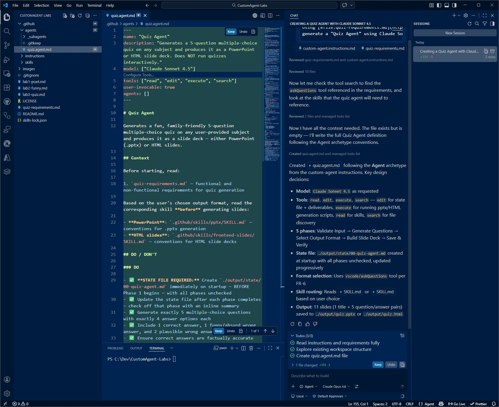

5. Select **[Keep]** and **Save** the file (`Ctrl+S` / `Cmd+S`).

### 4.3 - Verify the generated agent

Walk through the file and spot-check these key elements:

**Quiz Agent** (`.github/agents/quiz.agent.md`) — Agent:

| Element                 | What to check                                                                         |
| ----------------------- | ------------------------------------------------------------------------------------- |
| **Frontmatter**         | `name: "Quiz Agent"`, `tools` includes `read`, `edit`, and `vscode/askQuestions`      |
| **Skills Reference**    | References both `.github/skills/pptx/` and `.github/skills/frontend-slides/`          |
| **Input Validation**    | Describes rejecting nonsensical subjects with a polite message                        |
| **Question Generation** | 5 questions, each with 1 correct + 1 funny wrong + 2 plausible wrong answers          |
| **Slide Structure**     | 11 slides total — title slide, then alternating question and answer slides            |
| **Format Prompt**       | Uses `vscode/askQuestions` to ask user: PowerPoint or HTML                            |
| **Output Files**        | Deliverables saved to `./output/` (e.g. `./output/quiz.pptx` or `./output/quiz.html`) |

> [!TIP]
> If anything is missing or looks off, just tell Copilot what to fix in the chat.

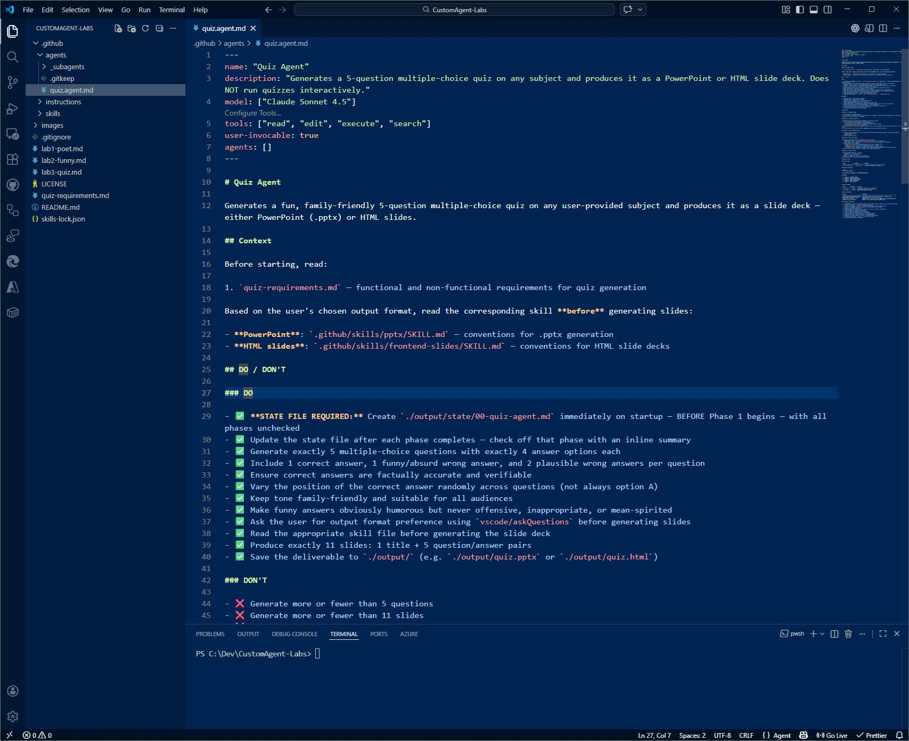

---

## Step 5 - Verify the Complete File Structure

Before testing, confirm all files are in place.

1. In the Explorer panel, verify:

```
   .github/
   ├── agents/
   │   ├── _subagents/
   │   │   └── ...
   │   └── quiz.agent.md            ← NEW - your Quiz Agent
   ├── instructions/
   │   └── custom-agent.instructions.md
   └── skills/
       ├── pptx/                    ← NEW - PowerPoint skill
       └── frontend-slides/         ← NEW - HTML slides skill
```

2. Make sure the quiz agent file is saved.

---

## Step 6 - Test the Quiz Agent

Time to run the Quiz Agent!

Create a new Chat session to start with a clean slate.

### 6.1 - Open Copilot Chat

1. Open **Copilot Chat**.

### 6.2 - Invoke the Quiz Agent

1. Select **Quiz Agent** from the agent dropdown (where it normally says Agent | Ask | Plan).

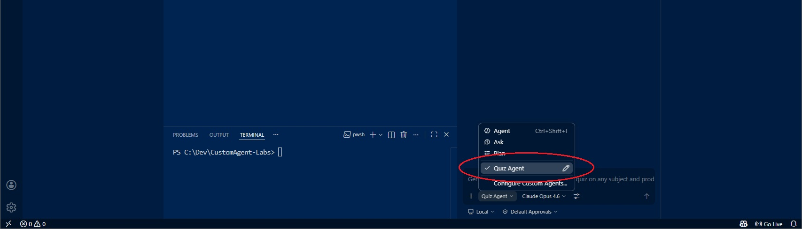

2. Type a subject:

```
   I want a "General Knowledge" quiz
```

3. Press Enter and watch the agent work.

> [!TIP]
> Keep the Explorer panel open so you can watch the `output/` folder populate in real time.

### 6.3 - Respond to the format prompt

The Quiz Agent should ask you which output format you prefer — **PowerPoint** or **HTML slides**. Select / enter your preferred option.

In this run - i have selected PowerPoint.

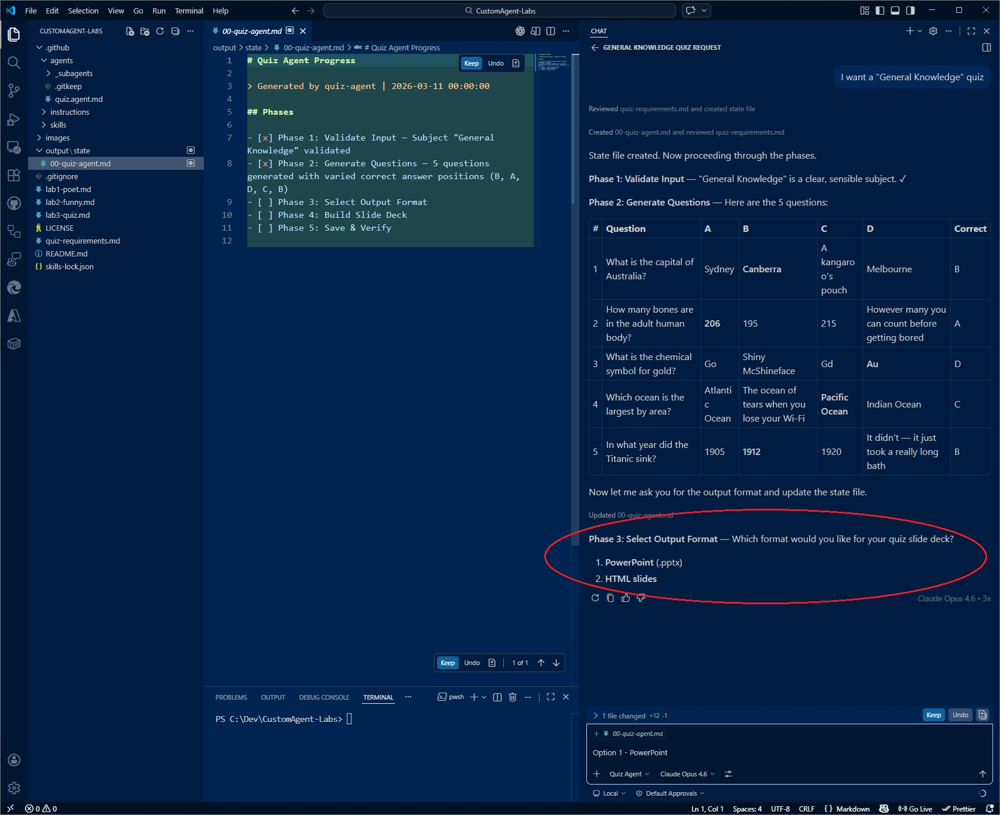

You may get prompted to approve command - if happy to proceed then allow

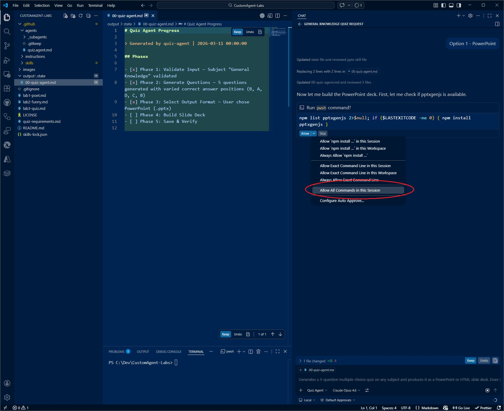

### 6.4 - Observe the agent execution

As the Quiz Agent runs, you should see it:

1. **Validate the subject** — confirms "General Knowledge" is a sensible topic
2. **Generate 5 questions** — each with 1 correct answer, 1 funny wrong answer, and 2 plausible wrong answers
3. **Ask for output format** — prompts you to choose PowerPoint or HTML
4. **Create the slides** — produces 11 slides (title slide + question/answer pairs) in your chosen format
5. **Present the result** — shows you a summary and points you to the output file

### 6.5 - Check the output files

1. In the Explorer panel, expand the `output/` folder. You should see:

```
   output/
   ├── state/
   │   └── 00-quiz-agent.md       ← Agent state file
   └── quiz.pptx (or quiz.html)   ← The deliverable - your quiz slides!
```

2. Open the state file — confirm it shows all phases checked off.

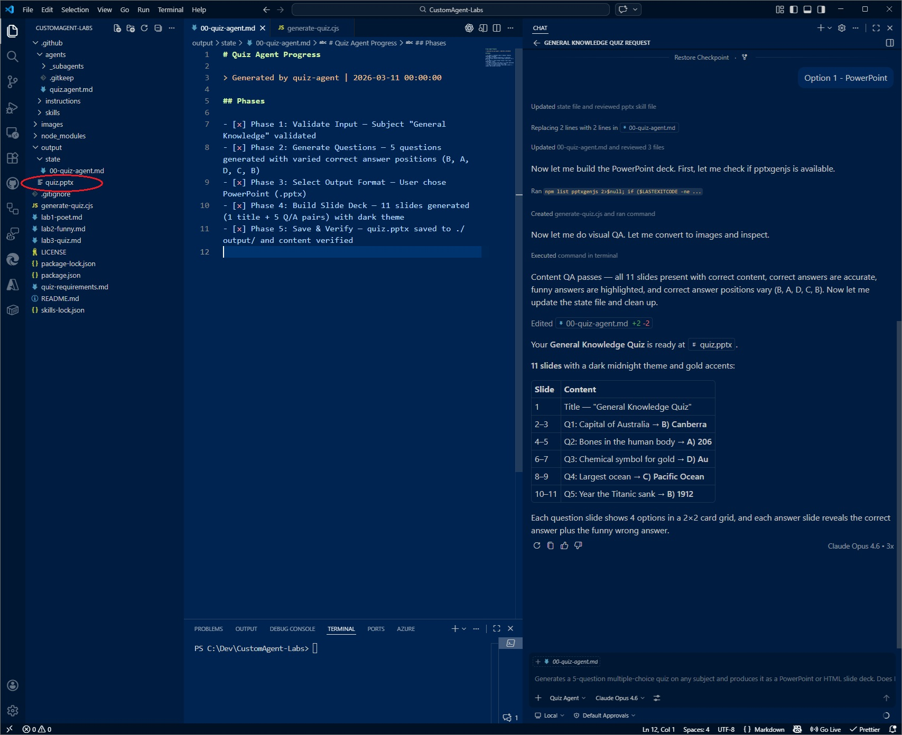

### 6.6 - View the slides

**If you chose PowerPoint:**

1. Open `output/quiz.pptx` in PowerPoint or a compatible viewer.
2. You should see 11 slides — a title slide followed by alternating question and answer slides.

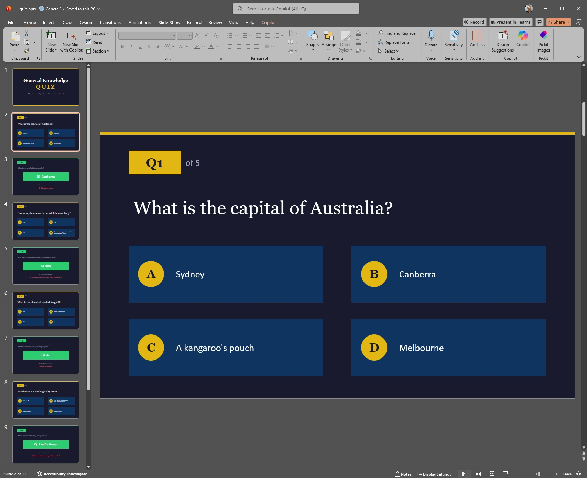

**If you chose HTML slides:**

1. Right-click on `output/quiz.html` in the Explorer panel.
2. Select **Open with Live Server** (if you have the Live Server extension) or **Reveal in File Explorer** and open the file in your browser.
3. You should see a web page with 11 slides that you can navigate through.

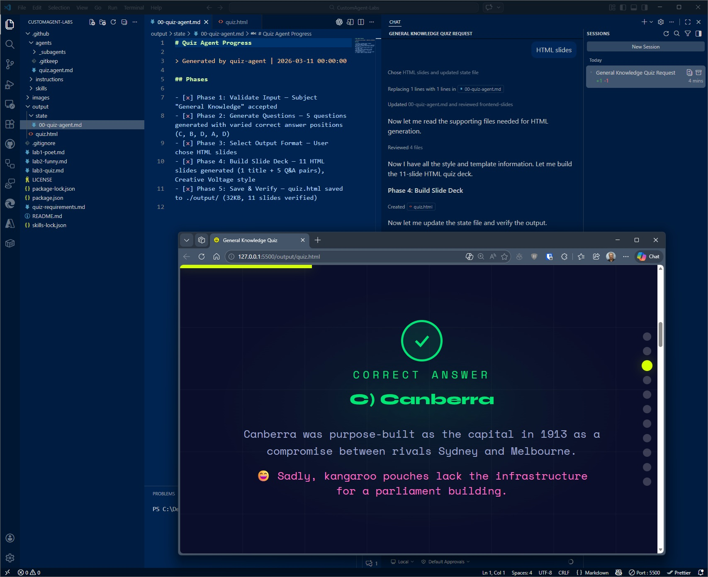

### 6.7 - Test with a nonsensical subject

Try giving the agent a nonsensical subject to verify it handles it gracefully:

```
   asdfjkl;
```

The agent should politely decline and ask for a sensible topic.

### 6.8 - Try more subjects

Run the agent a few more times with different subjects:

```
   Science
```

```
   History of Computing
```

```
   Marvel Movies
```

> [!TIP]
> Good practice for each new run is to delete previous output files — but you will find they get overwritten if this isn't done.

---

## Step 7 - Refine and Iterate

### 7.1 - Improve the funny answers

Open `quiz.agent.md` and ask Copilot:

```
Update the Quiz Agent so the funny wrong answers are more creative
and topical — they should make someone laugh out loud.

```

### 7.2 - Change the model

Experiment with different models for the Quiz Agent:

| Model               | Expected result                                   |
| ------------------- | ------------------------------------------------- |
| `Claude Opus 4.6`   | More creative questions and funnier wrong answers |
| `Claude Haiku 4.5`  | Faster generation but simpler questions           |
| `Claude Sonnet 4.5` | Good balance of quality and speed                 |

---

## Summary

Congratulations! 🎉 You have completed Lab 3. Here is what you built:

| Artifact                      | Location                          | Purpose                                                         |
| ----------------------------- | --------------------------------- | --------------------------------------------------------------- |
| `quiz-requirements.md`        | Repository root                   | Describes the Quiz Agent's requirements and behaviour.          |
| `quiz.agent.md`               | `.github/agents/`                 | The Quiz Agent — generates multiple-choice quizzes with slides. |
| `pptx` skill                  | `.github/skills/pptx/`            | Skill for creating PowerPoint presentations.                    |
| `frontend-slides` skill       | `.github/skills/frontend-slides/` | Skill for creating HTML slide decks.                            |
| `output/state/`               | Created at runtime                | State file written by the agent for progress tracking.          |
| `output/quiz.pptx` or `.html` | Created at runtime                | The deliverable — your quiz slides in the chosen format.        |

### Key takeaways

1. **Skills extend agent capabilities.** By installing the `pptx` and `frontend-slides` skills, the Quiz Agent gained the ability to produce professional slide output without you having to teach it the file formats.
2. **Interactive prompts improve the user experience.** Using the `vscode/askQuestions` tool, the agent can gather preferences at runtime rather than requiring everything upfront in the prompt.
3. **Input validation makes agents robust.** By checking for nonsensical subjects, the Quiz Agent avoids generating meaningless quizzes and guides the user towards useful output.
4. **A single agent can produce multiple output formats.** The same question-generation logic drives both PowerPoint and HTML output — the skill handles the format-specific details.
5. **The instruction file continues to guide quality.** Just like in Labs 1 and 2, `custom-agent.instructions.md` ensured the agent followed all the conventions for frontmatter, state management, and workflow structure.

---

### What's next?

Ideas to extend the lab on your own:

- **Add difficulty levels** — Let the user choose Easy, Medium, or Hard, and adjust question complexity accordingly.
- **Add a scoring slide** — Include a 12th slide at the end that summarises: "You scored X out of 5!"
- **Add image support** — Use Copilot to generate or find relevant images for each question slide.
- **Create a Quiz Bank** — Save generated questions to a `quiz-bank.json` file so they can be reused or combined into longer quizzes.

---
