# Hands-on Lab 4: Build a Price Comparison Agent with MCP Integration

## Overview

In this lab you will create a **GitHub Copilot Custom Agent** called the **Shopper Agent** that compares prices for grocery items across multiple online stores. This lab introduces a powerful new concept: **Model Context Protocol (MCP) servers** - external tools that dramatically extend what your custom agents can do.

The Shopper Agent will use the **Playwright MCP server** to visit real grocery websites, search for products, extract pricing information, and generate a comprehensive comparison report.

### What you will learn

- What **MCP** is and why it matters for custom agents.
- How to install and configure an **MCP server** (Playwright) in VS Code.
- How to declare **MCP tools** in agent frontmatter so the agent can use them.
- How to build an agent that orchestrates multiple web scraping tasks.
- How to generate structured **markdown reports** with price comparisons.

### Prerequisites

| Requirement                  | Details                                                                    |
| ---------------------------- | -------------------------------------------------------------------------- |
| **Completed Lab 1, 2 and 3** | You should be comfortable creating custom agents and understand workflows. |
| **GitHub account**           | Must have Copilot enabled.                                                 |
| **GitHub Copilot**           | Active subscription.                                                       |
| **VS Code**                  | Always use the latest.                                                     |
| **Node.js**                  | Required for installing MCP servers. Version 18+ recommended.              |
| **npx**                      | Comes with Node.js - used to run Playwright MCP .                          |

---

## What is MCP and Why Does It Matter?

**Model Context Protocol (MCP)** is an open standard that allows AI agents to connect to external tools and data sources in a standardized way. Instead of building custom integrations for every tool, MCP provides a universal connector.

### MCP in this lab

```diagram
┌────────────────────────────────┐
│      SHOPPER AGENT             │
│   (GitHub Copilot Custom)      │
└──────────────┬─────────────────┘
               │
               │ Uses mcp_playwright_* tools
               │
               ▼
┌────────────────────────────────┐
│     PLAYWRIGHT MCP SERVER      │
│  (Runs in VS Code background)  │
│                                │
│  • navigate(url)               │
│  • screenshot()                │
│  • evaluate(JavaScript)        │
└──────────────┬─────────────────┘
               │
        ┌──────┴──────┐
        │             │
        ▼             ▼
┌──────────┐   ┌──────────┐
│  Tesco   │   │  Ocado   │  ... and more
│ Website  │   │ Website  │
└──────────┘   └──────────┘
```

Key benefits:

- **Reusability**: One Playwright MCP server can be used by many agents.
- **Safety**: MCP servers run in a controlled environment, not directly in the agent.
- **Extensibility**: You can add new MCP servers (databases, APIs, tools) without changing your agent code.

> [!NOTE]
> In this lab, you'll see how custom agents and MCP servers work together seamlessly. In this case, the agent declares `playwright/*` in its `tools` array, and VS Code handles the rest.

---

## Step 1 - Open the Starter Repository in VS Code

You will use the same repository from Labs 1, 2, and 3. If you no longer have it, re-clone it now (see Lab 1, Step 1).

1. Open a **terminal** and navigate to the `lab-customagents-init` folder - for example:

````powershell
   cd c:\dev\lab-customagents-init

2. Open the folder in VS Code:

```powershell
   code .
````

3. In the **Explorer** panel, confirm the folder structure includes:

```diagram
   ./
   ├── .github/
   │   ├── agents/
   │   └── instructions/
   │       └── custom-agent.instructions.md
   ├── .vscode/
   │   └── mcp.json
   ├── README.md
   └── ...
```

4. Open **Copilot Chat** and confirm it is active.

---

## Step 2 - Install and Configure the Playwright MCP Server

**Playwright** is an open-source framework from Microsoft, widely used for **functional testing of web applications**. Developers write automated tests that launch a real browser, navigate to pages, fill in forms, click buttons, and assert that the application behaves correctly - all without a human touching the keyboard. It supports Chromium, Firefox, and WebKit, and is a standard part of many CI/CD pipelines.

In this lab, we repurpose that same browser-automation power for a completely different goal: **live web scraping by an AI agent**. Instead of a test script driving the browser, the Shopper Agent calls the Playwright MCP server to navigate to grocery websites, search for products, and extract pricing data. The underlying capability - programmatic control of a real browser - is identical; only the intent changes from "test my app" to "read someone else's website."

### Why this matters

Before your agent can use Playwright, you need to install the Playwright MCP server and configure VS Code to run it.

### 2.1 - Understand MCP server configuration

MCP servers are configured per-project using a `.vscode/mcp.json` file in the workspace root. This keeps MCP configuration scoped to the project and version-controlled alongside your code. Each server entry includes:

- **command**: The executable to run (e.g., `npx`)
- **args**: Arguments to pass (e.g., the MCP server package name)
- **env**: Optional environment variables

### 2.2 - Verify the MCP configuration file

1. In the Explorer panel, expand the `.vscode` folder.
2. Open the **`mcp.json`** file - it is already included in the lab repository.
3. Look for the `playwright` entry in the `"servers"` section:

```json
    "playwright": {
      "type": "stdio",
      "command": "npx",
      "args": ["-y", "@playwright/mcp@latest"]
    },
```

This tells VS Code that a Playwright MCP server is available for this workspace. The `@playwright/mcp@latest` package is the official Playwright MCP server - it exposes browser automation tools that your custom agents can use.

### 2.3 - Start the Playwright MCP server

There are two ways to start the Playwright MCP server:

#### Option A - Start from mcp.json (quickest)

1. Open the `.vscode/mcp.json` file in the editor.
2. You will see a **`▷ Start`** link displayed inline above the `"playwright"` server entry. VS Code renders these action links directly in the JSON file.
3. Click **`Start`** - the server will launch in the background.
4. Once running, the link changes to **`Stop`** - confirming the server is active. You will also see a tool count (e.g., `22 tools`) indicating the available Playwright tools.

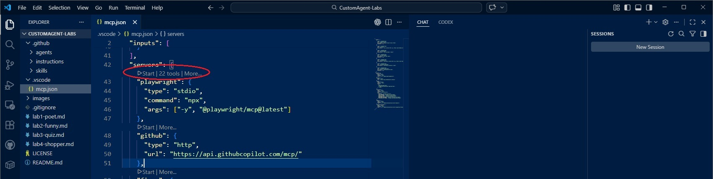

#### Option B - Start from the MCP Servers panel

1. Open the **Extensions** sidebar (`Ctrl+Shift+X`).
2. At the bottom of the sidebar, look for the **MCP Servers** section. You should see **playwright** listed.
3. Right-click on **playwright** to see options: **Start Server**, **Stop Server**, **Restart Server**, **Show Output**, **Show Configuration**, etc.
4. Click **Start Server** to launch the Playwright MCP server.

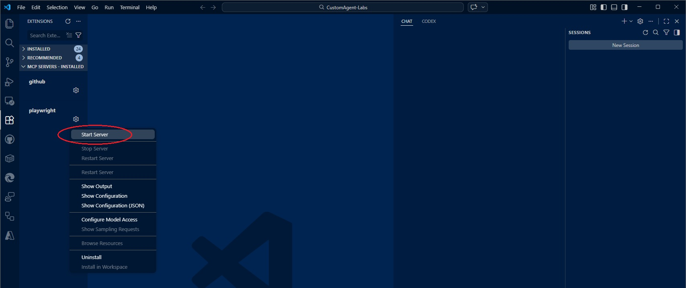

> [!TIP]
> The MCP Servers panel is useful for managing multiple servers at once. You can start, stop, and restart servers, view their output logs, and inspect their configuration

### 2.4 - Verify the MCP server is running

1. Confirm the server is running using either method:
   - In `mcp.json` - you should see **`Stop | 22 tools | More...`** next to the playwright entry.
   - In the MCP Servers panel - the playwright entry should show a running status.

2. You can also click the **Tools** button (the wrench/spanner icon at the bottom of the Copilot Chat panel, next to the model selector) to see all available tools - the Playwright MCP tools should be listed there.

> [!NOTE]
> **Understanding the Tools selector:** The Tools button is not just for viewing - it lets you **enable or disable individual tools** for a conversation. This is important because Copilot has a **limit of 128 tools** that can be active at once. Every active tool adds to the context sent to the model, consuming tokens and potentially diluting the model's focus. If you have multiple MCP servers running (e.g., Playwright, a database server, an API server), the total tool count can climb quickly. Use the Tools selector to **uncheck tools you don't need** for the current task - this keeps the context lean and helps the agent perform better. For this lab, make sure the `playwright` tools are enabled and consider disabling any unrelated tools.

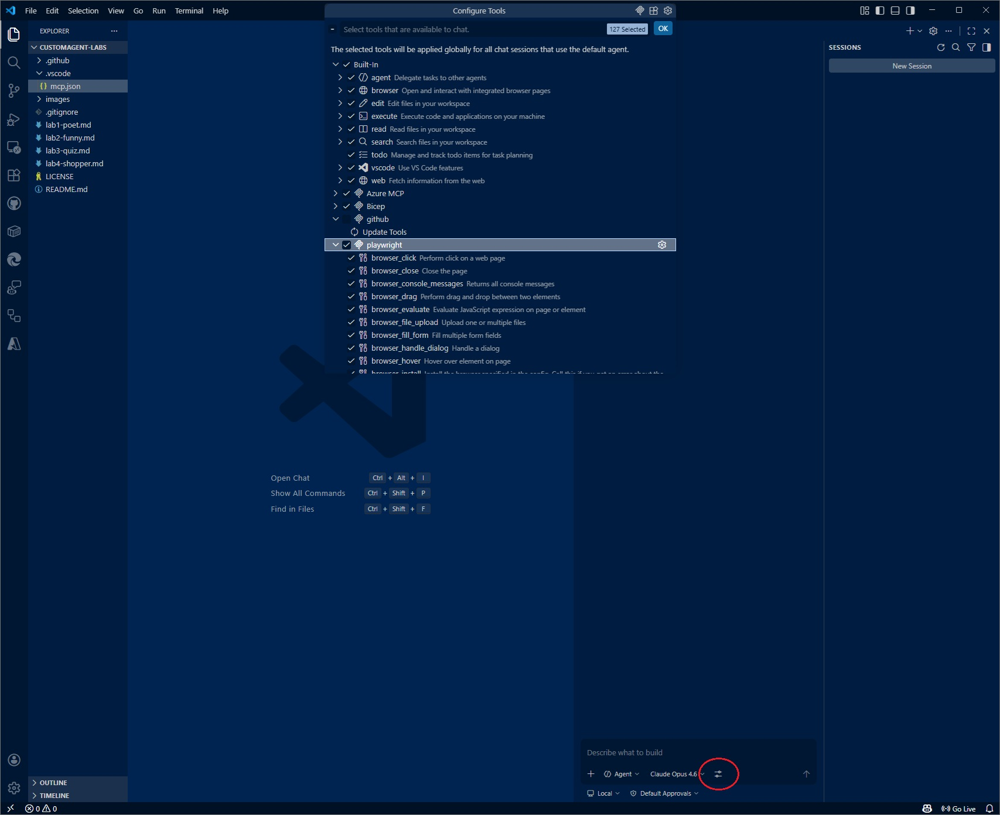

> [!IMPORTANT]
> Troubleshooting: If you don't see Playwright tools, check:
>
> - Node.js is installed (`node --version` in terminal)
> - The `.vscode/mcp.json` configuration is correct (no JSON syntax errors)
> - The server is started (click **Start** in `mcp.json` or the MCP Servers panel)

---

## Step 3 - Use Copilot to Write the Requirements Document

Just like in the previous labs, you will start by describing what the agent should do in a requirements document.

### 3.1 - Ask Copilot to draft the requirements

1. Open **Copilot Chat**.

2. Set the mode to **Plan** - click the mode selector at the bottom of the chat panel and choose **Plan**.

3. Type the following prompt into the chat:

   ```
   I want a custom agent that compares prices for a given item across UK grocery websites.

   The Workflow:

   1. User prompts with an item to purchase
   2. Agent searches the following stores via Playwright MCP tool:
      - Tesco (https://www.tesco.com/)
      - Ocado (https://www.ocado.com/)
      - Asda (https://www.asda.com/)
      - Morrisons (https://www.morrisons.com/)
      - Sainsbury's (https://www.sainsburys.co.uk/)
   3. A markdown report is written to `./output/`, with a filename reflecting the item searched

   Report Contents to include:

   - Timestamp of check and search term
   - For each store:
     - Price
     - Exact product name
     - Product link
     - Unit price (per kg/L)
     - Availability status e.g. Available / Item not available or found
   - Comparison notes when product sizes/weights differ across stores
   - Summary of findings

   Technical Requirements

   - Playwright functionality must be accessed via an MCP tool `playwright/*`

   Create a requirements document for this "Shopper Agent".

   ```

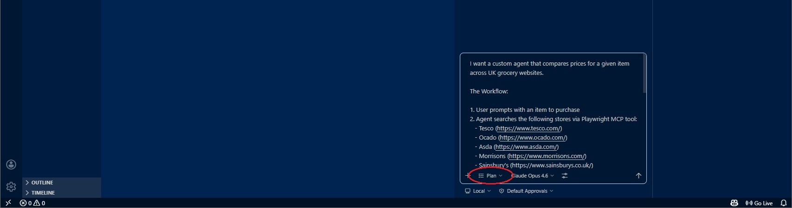

4. In Plan mode - the agent cannot write to the file. You have two options depending on how the agent responds. Either:
   - Copy the suggested requirements to the `shopper-requirements.md` file and save it
   - If given the option 'Open in Editor' select that and then save to `shopper-requirements.md`

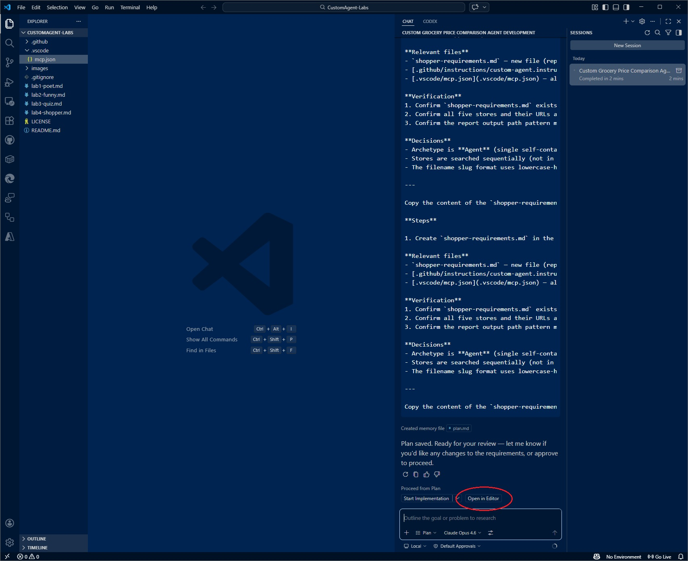

5.  Review the output - it should contain sections similar to:

| Section                     | What to look for                                                                        |
| --------------------------- | --------------------------------------------------------------------------------------- |
| Description                 | A one-liner explaining the Shopper Agent's purpose.                                     |
| Target User                 | Anyone comparing grocery prices across UK supermarkets.                                 |
| Functional Requirements     | Searches 5 stores, extracts pricing data, generates markdown report.                    |
| Non-functional Requirements | Must use Playwright MCP tools, handle missing products gracefully, complete in < 5 min. |
| Output Format               | Markdown report in `./output/{item}                          `                          |
| Example                     | Input: "Wonky Carrots" → Report with prices from 5 stores.                              |

### 3.2 - Review and refine

Read through the requirements. Feel free to edit them by hand or ask Copilot follow-up questions.

Save the file when you are satisfied.

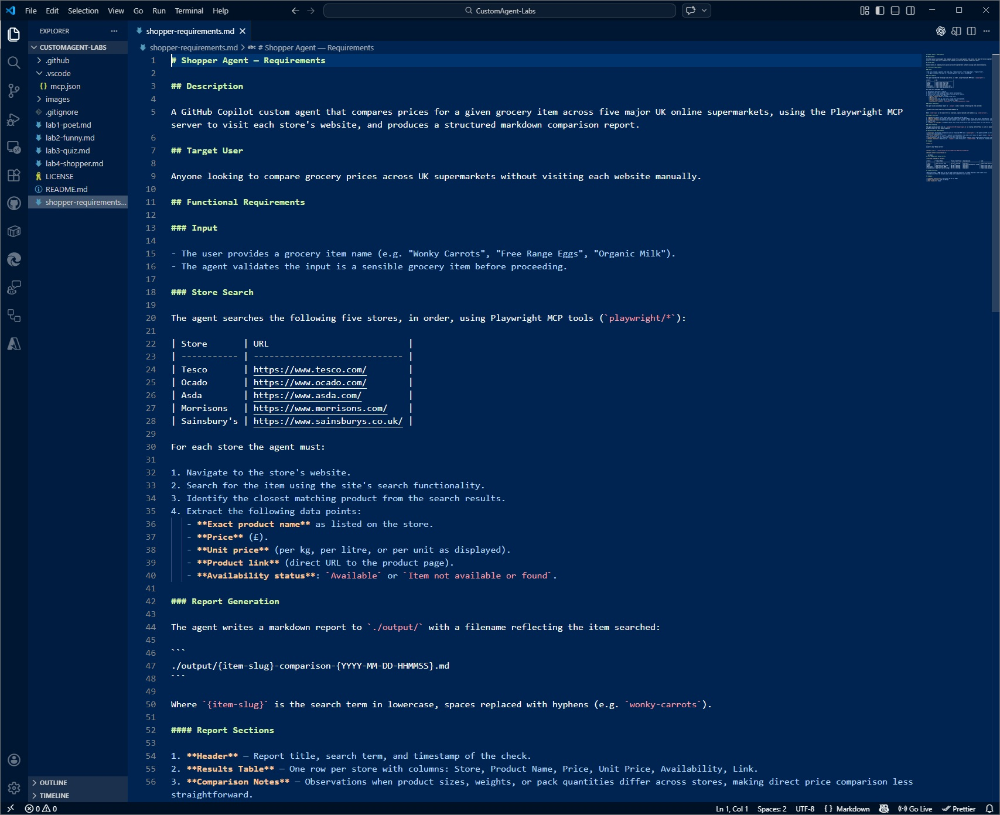

---

## Step 4 - Use Copilot to Create the Agent Definition File

Now you will create the actual `.agent.md` file that defines the Shopper Agent. The instruction file `custom-agent.instructions.md` will guide Copilot to produce a well-structured agent.

### 4.1 - Create the file in the correct location

Custom agents live in `.github/agents/`.

1. In the Explorer panel, right-click on the `.github/agents/` folder → **New File**.
2. Name the file: **`shopper.agent.md`**
3. Press Enter to create the empty file.

> [!IMPORTANT]
> The file name **must** end in `.agent.md`. This is what tells VS Code (and Copilot) that it is a custom agent definition.

Create a new Chat session to start with a clean slate - this avoids irrelevant context from prior conversations affecting the new conversation.

### 4.2 - Ask Copilot to scaffold the agent

1. Make sure the file `shopper.agent.md` is open and active in the editor (click on its tab).
2. Open **Copilot Chat** and make sure you are in **Agent** mode (not Ask or Plan) - Copilot needs to be able to create files.
3. Type the following prompt:

   ```
   Use #file:shopper-requirements.md  and #file:custom-agent.instructions.md to
   generate a "Shopper Agent" using Claude Sonnet 4.5.

   ```

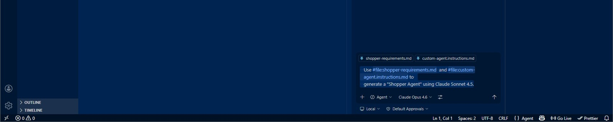

4. Copilot will generate a complete `shopper.agent.md` file. It uses the `custom-agent.instructions.md` file to help scaffold the agent and ensure it conforms to good practises.

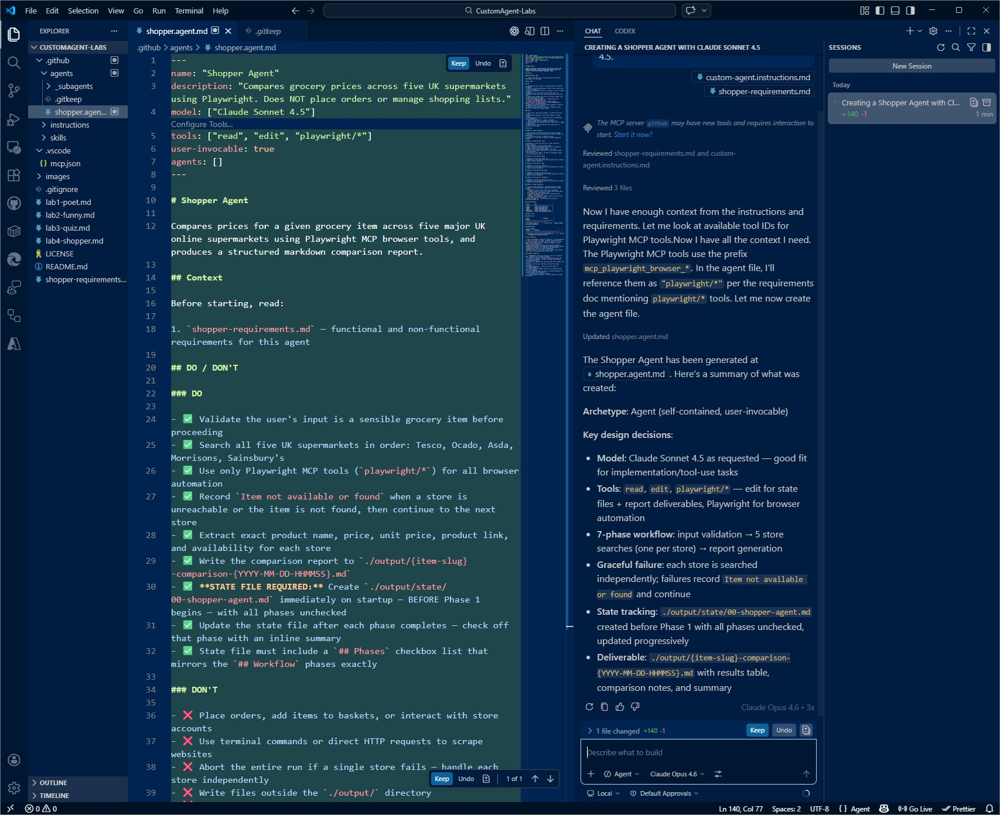

5. Select **[Keep]** and **Save** the file (`Ctrl+S` / `Cmd+S`).

### 4.3 - Verify the generated agent

Walk through the file and spot-check these key elements:

**Shopper Agent** (`.github/agents/shopper.agent.md`) - Agent:

| Element              | What to check                                                                                |
| -------------------- | -------------------------------------------------------------------------------------------- |
| **Frontmatter**      | `name: "Shopper Agent"`, `tools` includes `read`, `edit`, and `playwright_*` tools           |
| **Store List**       | Mentions all 5 stores: Tesco, Ocado, Asda, Morrisons, Sainsbury's                            |
| **Input Validation** | Phase 1 checks for sensible item (rejects nonsensical input)                                 |
| **Search Workflow**  | Phase 2 describes using Playwright to navigate, search, and extract pricing                  |
| **Report Structure** | Includes timestamp, per-store results (price, name, link, unit price, availability), summary |
| **Output File**      | Report saved to `./output/{item}-comparison-{timestamp}.md`                                  |
| **State File**       | Writes progress to `./output/state/00-shopper-agent.md`                                      |

> [!TIP]
> If anything is missing or looks off, just tell Copilot what to fix in the chat. The most critical element is that the `playwright/*` tools are declared in the frontmatter - without them, the agent won't be able to control browsers.

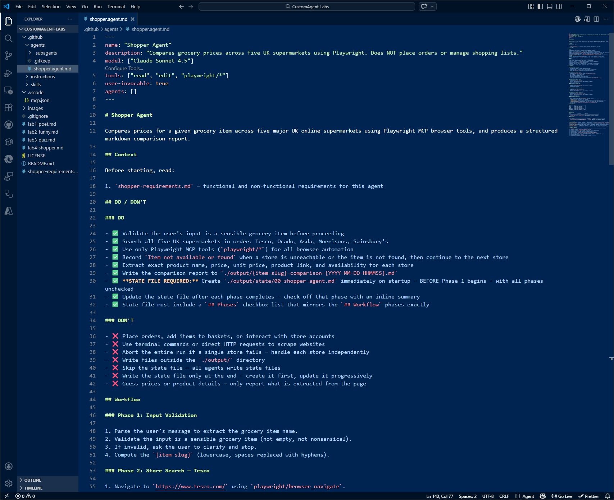

---

## Step 5 - Verify the Complete File Structure

Before testing, confirm all files are in place.

1. In the Explorer panel, verify:

```
   .github/
   ├── agents/
   │   ├── _subagents/
   │   │   └── ...
   │   └── shopper.agent.md         ← NEW - your Shopper Agent
   └── instructions/
       └── custom-agent.instructions.md
```

2. Make sure the shopper agent file is saved.

---

## Step 6 - Test the Shopper Agent

Time to run the Shopper Agent and see it search real grocery websites!

Create a new Chat session to start with a clean slate.

Make sure Playwright MCP is running.

### 6.1 - Open Copilot Chat

1. Open **Copilot Chat**.

### 6.2 - Invoke the Shopper Agent

1. Select **Shopper Agent** from the agent dropdown (where it normally says Agent | Ask | Plan).

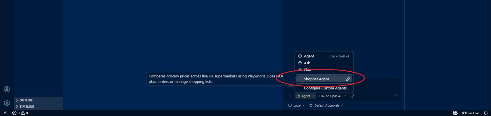

2. Type the test prompt:

   ```
   I want to buy "Wonky Carrots" (aka "Imperfect Carrots")
   ```

3. Press Enter and watch the agent work.

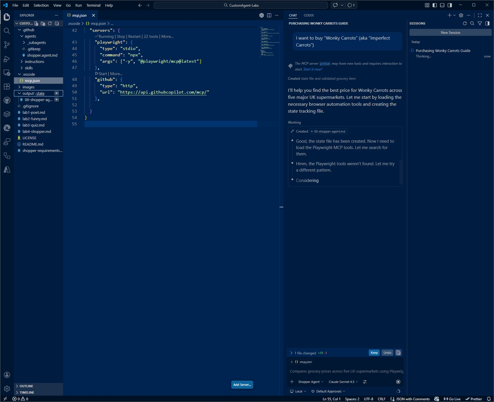

### 6.3 - Observe the agent execution

1. If there is any prompts asking for permission - if you are happy then Accept. After a time, the Agent may ask if it should "Continue to Iterate", again Accept for it to proceed.

> [!TIP]
> Keep the Explorer panel open so you can watch the `output/` folder populate in real time. This search may take a few minutes depending on website response times - the agent is visiting 5 live websites!

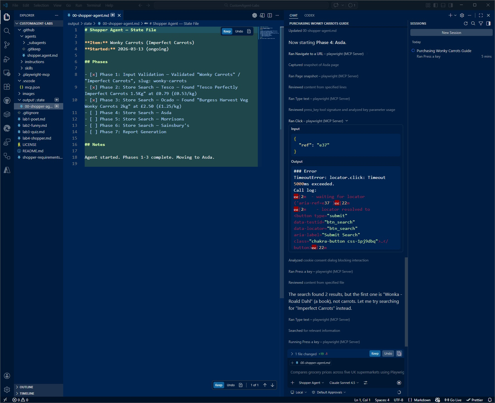

2. Eventually the Agent will complete its work.

As the Shopper Agent runs, you should see it:

1. **Validate the item** - confirms "Wonky Carrots" is a sensible grocery item
2. **Search each store** - uses Playwright MCP to navigate to each website, search for the product, and extract pricing
3. **Handle missing products** - some stores may not stock Wonky Carrots; the agent marks them as "Not available"
4. **Generate the report** - creates a markdown file with all findings
5. **Present results** - shows you a summary and points you to the report file

> [!NOTE]
> **What's happening behind the scenes:** The agent is calling `mcp_playwright_navigate` to visit each store's website, `mcp_playwright_evaluate` to run JavaScript that extracts product data from the page, and optionally `mcp_playwright_screenshot` to capture evidence. All of this happens through the MCP protocol - the agent never directly controls the browser; it asks the Playwright MCP server to do it.

### 6.4 - Check the output files

1. In the Explorer panel, expand the `output/` folder. You should see:

   ```
   output/
   ├── state/
   │   └── 00-shopper-agent.md      ← Progress tracking - phases checked off
   └── wonky-carrots-comparison-YYYY-MM-DD-HHMMSS.md  ← The deliverable!
   ```

2. Open the state file - confirm it shows all phases checked off.

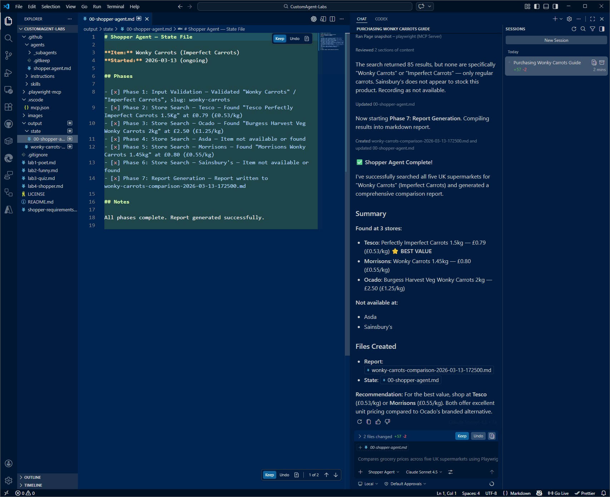

### 6.5 - View the comparison report

3. Open the comparison report - it should contain:
   - A timestamp and the search term
   - A table or structured list with results from each store
   - Price information (£ per item, £ per kg)
   - Product links
   - Availability status for each store
   - A summary comparing the best deals

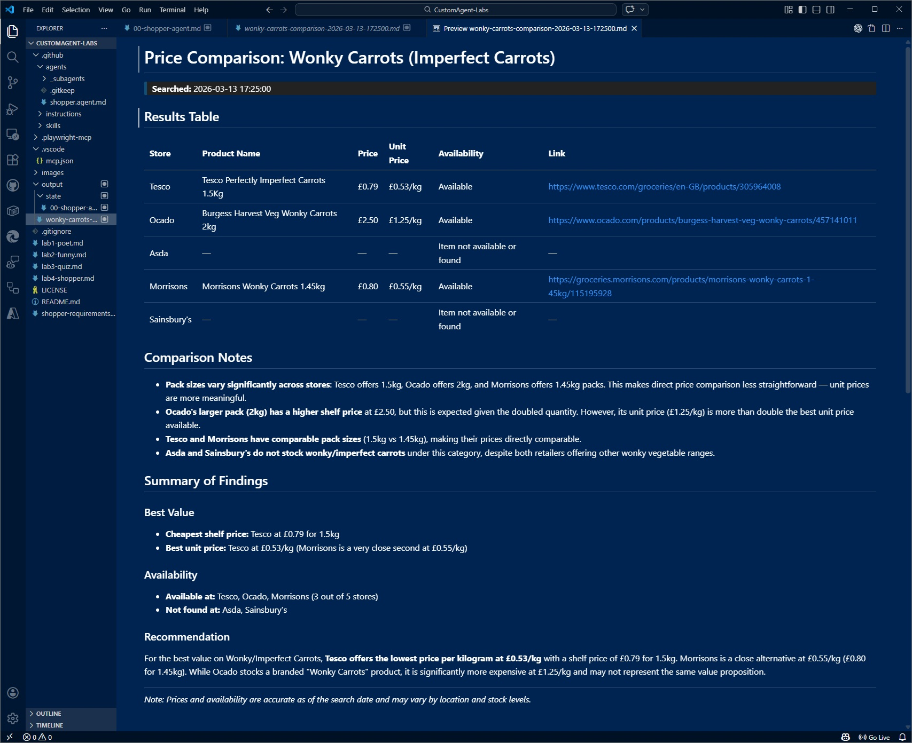

### 6.6 - Try more items

Run the agent a few more times with different grocery items:

```
I want to buy "Free Range Eggs"
```

```
I want to buy "Organic Milk"
```

## Step 7 - Refine and Iterate

### 7.1 - Things to try

- More stores / alternative stores ... perhaps add intelligence for the type of item being purchased.

- Improved error handling ... e.g. timeout after 30 seconds if a store is slow

- Add visual evidence - capture screenshots of the items being sold

- Add historical tracking - append a summary line to a `price-history.csv` file .

### 7.5 - Change the model

Experiment with different models for the Shopper Agent:

| Model               | Expected result                                         |
| ------------------- | ------------------------------------------------------- |
| `Claude Opus 4.6`   | More sophisticated web scraping, better error handling  |
| `Claude Sonnet 4.5` | Good balance of speed and reliability (recommended)     |
| `Claude Haiku 4.5`  | Faster but may struggle with complex website structures |

---

## Summary

Congratulations! 🎉 You have completed Lab 4. Here is what you built:

| Artifact                                  | Location           | Purpose                                                           |
| ----------------------------------------- | ------------------ | ----------------------------------------------------------------- |
| `shopper-requirements.md`                 | Repository root    | Describes the Shopper Agent's requirements and behavior.          |
| `shopper.agent.md`                        | `.github/agents/`  | The Shopper Agent - compares grocery prices using Playwright MCP. |
| Playwright MCP server configuration       | `.vscode/mcp.json` | Tells VS Code to run the Playwright MCP server.                   |
| `output/state/00-shopper-agent.md`        | Created at runtime | State file written by the agent for progress tracking.            |
| `output/{item}-comparison-{timestamp}.md` | Created at runtime | The deliverable - your price comparison report!                   |

### Key takeaways

1. **MCP extends agents with real-world capabilities.** By connecting to the Playwright MCP server, your agent can control web browsers, scrape websites, and extract data - all through a standardized protocol.

2. **MCP tools are declared in frontmatter.** The agent specifies which tools it needs in its `tools` array, and VS Code ensures the corresponding MCP servers are running and accessible.

3. **Agents orchestrate, MCP servers execute.** The agent plans the workflow ("search Tesco, then Ocado, then ..."), but the Playwright MCP server does the actual browser automation. This separation keeps agents simple and MCP servers reusable.

4. **MCP is composable.** You could add a **Database MCP server** to store historical prices, a **Notification MCP server** to alert you when prices drop, or a **Chart MCP server** to visualize trends - all without changing the Shopper Agent's core logic.

5. **Structured output makes data actionable.** The markdown report format is human-readable but also machine-parseable - you could build another agent that reads these reports and generates shopping lists or budget recommendations.

---

### What's next?

Ideas to extend the lab on your own:

- **Add a Budget Agent** - Create a subagent that reads comparison reports and tells you which items fit your weekly budget.
- **Track price history** - Modify the agent to save each search result to a CSV or database using a Database MCP server.
- **Add notifications** - Use a Notification MCP server to send an alert when a product drops below a target price.
- **Expand to other categories** - Extend the agent to compare electronics prices across Amazon, Currys, and Argos.

---

### Learn more about MCP

- **Official MCP Specification:** [https://modelcontextprotocol.io/](https://modelcontextprotocol.io/)
- **VS Code MCP Documentation:** [https://code.visualstudio.com/docs/copilot/customization/mcp-servers](https://code.visualstudio.com/docs/copilot/customization/mcp-servers)
- **Playwright Documentation:** [https://playwright.dev/docs/intro](https://playwright.dev/docs/intro)
- **Other MCP Servers:** Browse the community catalog at [https://github.com/mcp](https://github.com/mcp)

---

Mark Harrison
